# Kubernetes

基础概念

Master：控制平面

Worker：工作平面

有效的Kubernetes部署称为集群，也就是一组运行Linux容器的主机

可以将 Kubernetes 集群可视化为两个部分：控制平面与计算设备（或称为工作节点）

控制平面负责维护集群的预期状态，例如运行哪个应用以及使用哪个容器镜像，工作节点则负责应用和工作

负载的实际运行


## Node节点宕机

kubelet 默认每隔 10 秒向 API Server 发送一次节点状态更新的心跳信号，当 kubelet 在一定时间内未向 API Server 发送节点状态更新的心跳信号时，它会将节点标记为 `NotReady`，但并不会马上从集群中移除。节点的真正标记为不可用需要更多的时间和额外的步骤。

一旦节点在一定时间内（默认为 40 秒）未发送心跳信号，Kubernetes 控制平面会将该节点标记为 `NotReady`，但它仍然会在集群中保留。随后，Kubernetes 会启动一系列检查和补救措施，比如尝试重新与节点建立连接、检查节点的网络状态等。只有在经过一段时间后（默认为 5 分钟），如果节点仍然无法恢复，Kubernetes 才会将该节点标记为不可用，并将其中的 Pod 重新调度到其他节点上。


## Kubernetes系统组件


```
注意：Pod是K8s中最小的调度单位，因此Pod中多个容器都是统一调度

用户通过调用 api-server 来执行某些操作(创建、删除等)，创建请求之后由 Scheduler 负责在众多Node节点（工作节点）通过一系列调度策略和调度算法，把Pod 调度至工作节点，之后由该节点的Kubelet负责管理该节点上的容器和 Pod。它监视节点上的容器运行时状态，并与主控制平面（通常是 API 服务器）通信以获取分配给该节点的任务并报告节点和容器的状态。如Pod挂了Kubelet会重启此Pod，但是如果节点因为某种原因变得不可用，比如节点故障、网络故障等，那么该节点上的 Kubelet 也会停止工作，无法继续监视和管理该节点上的 Pod。在这种情况下，Kubernetes 控制平面通常会通过其他机制（例如控制器）检测到节点的不可用，并且会采取措施，例如重新调度 Pod 到其他可用节点上，以确保应用程序的高可用性和可靠性。controller manager 来确保我们创建的Pod健康性，如果Pod少了一个，他会自动请求Api-server 重新创建一个出来。


Etcd负责存储 raft协议确保数据一致性（分布式，自带集群），etcd底层存储引擎他没有固定格式，因此我们要通过Api server 往etcd中存取数据，Api-server的数据格式是有要求的，必须满足要求才可以存

在 Kubernetes API 中，用于判断请求的格式是否正确的关键组件是 Admission Controller。

Admission Controller 在 API 请求到达 API 服务器之后对其进行拦截，并对请求中的对象进行验证。它可以执行各种操作，例如检查对象的格式、应用默认值、强制执行安全策略等。Admission Controller 可以确保在对象被持久化到 etcd 之前，对其进行必要的验证和修改。

Kubernetes 中有许多内置的 Admission Controller，例如 NamespaceLifecycle、ResourceQuota、PodSecurityPolicy 等。此外，还可以编写自定义的 Admission Controller，以满足特定的需求或实现自定义的验证逻辑。


对于每个节点我们要运行容器/Pod，不论是api-server还是controller manager，他们只是发出运行Pod/容器的指令，而真正运行容器负责管理节点上的容器和/Pod的 kubelet，由它负责执行由 API 服务器下发的指令，比如创建、删除、修改 Pod 等。Kubelet 通过与 Docker、containerd 或其他符合容器运行时接口（CRI）的容器运行时进行交互，来管理容器的生命周期，并监视 Pod 的运行状态，并将状态报告回 API 服务器。
```


 

REST ful ：类似于面向对象，把类抽象成资源对象，然后遵循类的规范，像字段赋值/类赋值，创建出的对象

资源对象被看作是面向对象编程中的类，而创建出来的实例则类似于类的实例。每个资源对象都具有一组属性和状态，并且可以通过 RESTful API 来对其进行 CRUD 操作（创建、读取、更新、删除）。

例子：

1. **房屋设计图纸（Resource Class）**：假设我们有一套房屋设计图纸，定义了房屋的结构、大小、布局等属性，这可以看作是房屋类（类似于 Kubernetes 中的资源类）。
2. **按设计图纸建造房屋（Resource Instance）**：基于设计图纸，我们可以建造出一栋具体的房屋，每栋房屋都是该设计图纸的一个实例（类似于 Kubernetes 中的资源实例）。每栋房屋都有自己的地址、外观、内部装修等属性。我们可以修改图纸上的值，或者给他赋值创建出不同的房子
3. **建造工程（API）**：建造房屋的过程需要进行一系列操作，比如打地基、搭建框架、安装管道等。这些操作可以看作是建造房屋的 API，您可以通过这些操作来管理房屋的建造过程。（管理，控制，查看等）
4. **施工队伍（Kubelet）**：施工队伍是实际负责房屋建造工作的人员，他们按照设计图纸和施工计划来完成房屋的建造。在 Kubernetes 中，Kubelet 类似于施工队伍，负责管理节点上的容器和 Pod。
5. **监理（Controller Manager）**：监理负责确保房屋按照设计要求进行建造，如果出现问题，会及时采取措施进行调整。在 Kubernetes 中，Controller Manager 类似于监理，负责确保集群中的资源状态符合用户定义的预期。

kubelet 负责管理节点上的容器和 Pod 的运行状态，而 controller manager 则负责管理集群中各种资源的状态

Controller Manager  == 包含多种不同的Controlller 他们都用来管理不同的资源对象

Kube-Proxy 用于把每个节点扩展为可编程的负载均衡器，

iptables 因为iptables规则是线性检查的。当规则数量增加时，iptables 需要逐条检查每个规则，这可能导致性能下降，特别是在规则数量非常大的情况下。 ipvs 


### Service

服务发现，服务注册 

为了应对后端 Pod 不稳定的 IP 地址或者扩缩容的情况，我们需要负载均衡器自动将新的 Pod 加入到负载均衡中。

我们给每个创建或即将创建的Pod 打上标签，随后Service 配置过滤标签，就是只要Pod满足我的标签，但凡能匹配到的Pod 都会被我

如果我们定义了一组Pod用来接收用户请求，因此我们需要负载均衡器来满足我们后端Pod 不断变化的需求，

Service 为每一组 Pod 提供了一个虚拟的服务入口点，这组 Pod 可以位于集群中的不同节点上。为了实现负载均衡，需要在每个节点上都配置相同的负载均衡规则，以确保无论请求到达哪个节点，都可以正确地转发到后端的 Pod。


##### **Pod请求pod**

首先，一个 Pod 发出请求，请求可能是发送到另一个 Pod，请求到达内核的 IPVS 规则：请求首先到达发送请求的 Pod 所在节点的内核，那么请求会被 IPVS 规则拦截，根据 IPVS 规则的解析，请求最终被转发到相应的 Service IP。

##### 用户请求Pod

我们事先创建了Service，并且把Pod 80 端口映射到Node节点的32000端口

客户端请求首先到达节点的指定端口（例如 10.0.0.200:32000），求先到达此Node 内核空间的 input链前 然后由节点的 iptables 规则进行匹配，（如果你访问32000 就对应某个Service 的 Cluster IP ）当请求匹配到相应的 Service 时，iptables 会将请求转发到 Service 的 Cluster IP。Service 接收到请求后，根据其负载均衡策略选择一个后端 Pod，并将请求转发给该 Pod。如果选择的后端 Pod 正好位于请求所在的节点上，请求将直接在节点内部被转发到该 Pod；如果后端 Pod 不在同一节点，请求将通过网络被路由到对应节点，并在那里被进一步转发给目标 Pod。


当用户请求的 Pod 不在当前节点时，当前节点的 kube-proxy 会执行以下步骤来确定目标 Pod 在哪个节点，并对请求进行 VXLAN 封装：

IPVS 规则本身不会记录后端 Pod 的具体地址，它只会将请求转发到 Service 的 IP 地址上。一旦请求到达 Service 的 IP 地址，实际的后续转发是由 kube-proxy 和 Service 实现的。

当用户请求到达当前节点时，IPVS 规则会将请求转发到 Service 的 Cluster IP 地址上，根据负载均衡策略选择一个后端 Pod，并将请求转发给该 Pod，如果选择的后端 Pod 不在当前节点上，那么当前节点的 kube-proxy， 会查询 Endpoints API，该 API 包含了与 Service 相关联的后端 Pod 的信息，包括它们所在的节点。一旦获取到目标 Pod 所在的节点信息，就会通过网络插件转发到对方主机

通常情况下，Flannel 会通过 etcd（或其他 key-value 存储）来存储节点之间的网络拓扑信息，包括节点的 IP 地址和 VTEP 接口的 MAC 地址。当一个节点需要发送数据到另一个节点时，它会查询 etcd 来获取目标节点的 VTEP 接口的 MAC 地址。


#### Kubernetes网络模型

##### Kubernetes网络模型

ubernetes集群上会存在三个分别用于节点、Pod和Service的网络

于worker上完成交汇，由节点内核中的路由模块，以及iptables/netfilter和ipvs等完成网络间的流量转发


**节点网络**

集群节点间的通信网络，并负责打通与集群外部端点间的通信

w络及各节点地址需要于Kubernetes部署前完成配置，非由Kubernetes管理，因而，需要由管理员手动进行，

或借助于主机虚拟化管理程序进行

**Pod网络**

为集群上的Pod对象提供的网络

虚拟网络，**需要经由CNI网络插件实现**，例如Flannel、Calico、Cilium等

**Service网络**

在部署Kubernetes集群时指定，各Service对象使用的地址将从该网络中分配

 Service对象的IP地址存在于其相关的iptables或ipvs规则中

 由Kubernetes集群自行管理

#### Kubernetes集群中的通信流量

Kubernetes网络中主要存在4种类型的通信流量

同一Pod内的容器间通信、Pod间的通信、Pod与Service间的通信、集群外部流量与Service间的通信

Pod网络需要借助于第三方兼容CNI规范的网络插件完成，这些插件需要满足以下功能要求

所有Pod间均可不经NAT机制而直接通信

所有节点均可不经NAT机制直接与所有Pod通信

所有Pod对象都位于同一平面网络中


#### Kubernetes集群组件运行模式

部署集群：

​	Master：3，5，7，

​	Worker：取决于业务规模


**独立组件模式**

除Add-ons以外，各关键组件以二进制方式部署于节点上，并运行于守护进程，各Add-ons以Pod形式运行。


**静态Pod模式**

控制平面各组件以静态Pod对象运行于Master主机之上

kubelet和 CRI 以二进制部署，运行为守护进程，kube-proxy等则以Pod形式运行

集群启动之前需要依赖的组件以静态Pod方式部署


控制平面接受来自管理员（或 DevOps 团队）的命令，并将这些指令转发给工作节点

创建多个Pod是一个一个调度
每次调度都要按照当前找资源镜像评分
controller-manager
    节点监视周期 5s
    节点监视器宽限期 40s
    pod驱逐重建 5m

service 相当于k8s内部的负载均衡器


每个node上的poxy和kubelet一致whact api server  但当node节点的特别多  master连接数会很多


```
git clone https://github.com/iKubernetes/learning-k8s.git
```


kubectl describe pod

 kubectl exec -it  deploy-f5957cfb5-mksjv -n myapp -- bash -c name bash 进入某个pod 中的某个容器


StorageClass 

k8s不提供nfs创建驱动 NFS

存储类调用驱动去NFS服务器上创建目录 

所有节点安装 nfs


configmap

给容器提供配置文件

存储在etcd   kubelet 

我们通过 kubectl 调用api-server  kube死干就乐儿 调度到某个node

kubelet根据配置清单 调用运行时创建pod  还有其他配置比如挂载nfs

kubelet调用kernel  把网络上的NFS挂载到宿主机也就是当前node

还有configmap kubelet会再次请求api server 到etcd把configmap 返回给kubelet

kubelet 再把它放在宿主机的目录 /var/lib/kubelet

kubelet 负责某些容器运行 环境的初始化


使用前先创建   通常小于1M

 configmap 不能跨 namespace 使用  一个configmap可以被多个pod挂载


跳过自建CA 申请证书

kubectl create secret tls myserve --cert=./server.crt  --key=./server.key -n myapp


```
incude  /etc/nginx/conf.d/*/*.conf
```

用confMap 挂载配置文件  用secret 挂载证书 从而实现https 的跳转


headless server 可以做mysql读写分离 

比如我们有三个mysql  一个写两个从  我们写 10.0.0.1  读我们设一个svc    headless server 后面绑两个从mysql 访问这个 无头服务  可以降低主库的压力


从前向后部署  从后往前伸缩


命令式，操作过程

k8s 遵守声明式API，我们只需要声明，具体底层怎么实现我们不用管

# 核心资源对象

## Namespace

命名空间（Namespace）是一种用于对集群资源进行逻辑分组和隔离的机制。命名空间为用户提供了一种将不同类型的资源（如 Pod、Service、Deployment 等）进行逻辑分组的方式，以便更好地管理和组织这些资源。

```
逻辑分组：命名空间允许用户将集群中的资源按照逻辑关系进行分组
授权和权限控制：通过授权机制，可以限制用户或服务账号对特定命名空间中资源的访问权限，从而提高集群的安全性。
资源配额： Kubernetes 支持在命名空间级别设置资源配额，以限制命名空间中资源的使用量。这可以防止某个命名空间中的资源耗尽集群资源，保证集群的稳定性和可用性。
提高集群性能:进行资源搜索时，名称空间有利于Kubernetes API缩小查找范围，从而对减少搜索延迟和提升性能有一定的帮助
```

 资源对象名称隔离，跨命名空间可以同名

##### Kubernetes的名称空间可以划分为两种类型

系统级名称空间：由Kubernetes集群默认创建，主要用来隔离系统级的资源对象

自定义名称空间：由用户按需创建

**系统级名称空间**

```
default：默认的名称空间，为任何名称空间级别的资源提供的默认设定

kube-system：Kubernetes集群自身组件及其它系统级组件使用的名称空间，Kubernetes自身的关键组件均部署

在该名称空间中

kube-public：公众开放的名称空间，所有用户（包括Anonymous）都可以读取内部的资源

kube-node-lease：节点租约资源所用的名称空间

​ 分布式系统通常使用“租约（Lease）”机制来锁定共享资源并协调集群成员之间的活动

​ Kubernetes上的租约概念由API群组coordination.k8s.io群组下的Lease资源所承载，以支撑系统级别的功能需求，例如节点心跳（node heartbeats）和组件级的领导选举等	

​ Kubernetes集群的每个节点，在该名称空间下都有一个与节点名称同名的Lease资源对象
```

**所有的系统级名称空间均不能进行删除操作，而且除default外，其它三个也不应该用作业务应用的部署目标**

## Pod

Pod是kubernets中最小的调度单位

一个pod中可以运行单个，或多个容器

运行一个Pod中包含多个容器，他们是一起调度的，最终运行在同一个目标主机

Pod中的多个容器共享同一个网络 通过Pause 文件系统是隔离的

如果用Pod资源类型创建Pod他是不会故障自愈的

因此我们一般使用，Colloler创建Pod


### Pod设计模式

基于容器的分布式系统中常用的3类设计模式

◼ 单容器模式：单一容器形式运行的应用

◼ 单节点模式：由强耦合的多个容器协同共生

◼ 多节点模式：基于特定部署单元（Pod）实现分布式算法

单节点多容器模式

◼ 一种跨容器的设计模式

◼ 目的是在单个节点之上同时运行多个共生关系的容器，因而容器管理系统需要由将它们作为一个原子单位进

行统一调度


节点多容器模式的常见实现

**Sidecar模式**

  ◆Pod中的应用由主应用程序（通常是基于HTTP协议的应用程序）以及一个Sidecar容器组成

  ◆辅助容器用于为主容器提供辅助服务以增强主容器的功能，是主应用程序是必不可少的一部分，但却未必非得运行


 **Ambassador模式**

  ◆Pod中的应用由主应用程序和一个Ambassador容器组成

  ◆辅助容器代表主容器发送网络请求至外部环境中，因此可以将其视作主容器应用的“大使”

  ◆应用场景：云原生应用程序需要诸如断路、路由、计量和监视等功能，但更新已有的应用程序或现有代码库以添加

这些功能可能很困难，甚至难以实现，进程外代理便成了一种有效的解决方案节点多容器模式的常见实现


**Adapter模式**

◆Pod中的应用由主应用程序和一个Adapter容器组成

◆Adapter容器为主应用程序提供一致的接口，实现了模块重用，支持标准化和规范化主容器应用程序的输出以便于外部服务进行聚合

 **Init Container模式**

  ◆一个Pod中可以同时定义多个Init容器

  ◆Init容器负责以不同于主容器的生命周期来完成那些必要的初始化任务，包括在文件系统上设置必要的特殊权限、

数据库模式设置或为主应用程序提供初始数据等，但这些初始化逻辑无法包含在应用程序的镜像文件中，或者出于

安全原因，应用程序镜像没有执行初始化活动的权限等等

  ◆Init容器需要串行运行，且在所有Init容器均正常终止后，才能运行主容器

**总结**
    为定义在containers字段中的容器，执行初始化任务，因此，初始化容器成功运行并退出后，常规容器才能启动、运行；而且，如果存在多个初始化容器，那么他们将以串行方式运行，且全部都成功退出，常规容器才能启动；

    命令：kubectl proxy 
        给API Server启用一个代理，默认是http协议
        
        kubectl proxy 是一个命令行工具，用于创建一个本地代理服务器，将本地计算机和 Kubernetes 集群的 API Server 连接起来。通过这个代理服务器，您可以通过 HTTP 请求与 Kubernetes API 进行交互，而无需直接暴露 API Server。这对于开发、调试和测试来说非常方便。
    
    当您使用 kubectl proxy 时，您的本地计算机与 Kubernetes 集群的 API Server 之间建立了一个安全的 HTTP 连接。这个连接是通过 kubectl 的配置文件和凭证进行认证和授权的，这意味着您必须具有足够的权限才能执行相关的操作。
    
    如果您在 Pod 中运行 kubectl proxy，那么 Pod 中的容器可以通过代理服务器访问 Kubernetes API Server，即使这些容器没有 Service Account。这是因为 kubectl proxy 代理服务器与 Kubernetes API Server 之间的连接已经建立，并且对于 API 访问的认证和授权是通过 kubectl 的配置文件和凭证进行的，而不是通过 Pod 的 Service Account。
    
    需要注意的是，Pod 中的容器可以通过 kubectl proxy 访问的 API 仅限于 API Server 公开的那些端点。默认情况下，API Server 会对外部访问进行一定的限制，以确保安全性和可靠性。


```
Pod状态 状态含义及可能的原因
Pending Pod未能由Scheduler完成调度，通常由于资源依赖、资源不足和调度策略无法满足等原因导致
Init:N/M Pod中定义了M个Init容器，其中N个已经运行完成，目前仍处于初始化过程中
Init:Error Init容器运行失败，需借助日志排查具体的错误原因
Init:CrashLoopBackOff Init容器启动失败，且在反复重启中，一般应该先确认配置方面的问题，再借助于日志进行排查
Completed Pod中的各容器已经正常运行完毕，各容器进程业已经终止
CrashLoopBackOff Pod启动失败，且处于反复重启过程中，通常是容器中的应用程序自身运行异常所致，
可通过查看Pod事件、容器日志和Pod配置等几方面联合排查问题
ImagePullBackOff Image拉取失败，检查Image URL是否正确，或手动测试拉取是否能够正常完成
Running Pod运行正常；但也额外存在其内部进程未正常工作的可能性，此种情况下，可通过查看Pod事件、容器日志、
Pod配置等几方面联合排查问题，或通过交互式测试验证问题所在
Terminating Pod正处于关闭过程中，若超过终止宽限期仍未能正常退出，可使用命令强制删除该Pod
（命令：kubectl delete pod [$Pod] -n [$namespace] --grace-period=0 --force）
Evicted Pod被节点驱逐，通常原因可能是由节点内存、磁盘空间、文件系统的inode、PID等资源耗尽所致，可通过Pod的status字段确定具体的原因所在，并采取有针对性的措施扩充相应的资源
```


### Pod 容器安全上下文

Security Context 

创建和运行容器时使用的运行时参数，给用户为Pod或容器定义特权和访问控制机制

Kubernetes支持在Pod及容器级别分别使用安全上下文（可以在init容器中加上特权执行初始化等等操作，他初始完成就会退出，因此不应该给我们的业务容器太大权限，因为他一旦启动就会一直拥有次权限）


Dockerfile 默认是root用户，但默认容器总的Root并不是真正的Root，只是在容器内Root，在宿主机并没有实际Root权限

可以在docker file 中指定默认用户Dockerfile: USER, GROUP; UID, GID 


```bash
#定义运行时用户
#在Pod级别不能使用sysctls会影响其他容器的内核参数
Pod级别： runAsUser、runAsGroup、runAsNonRoot
容器级别：runAsUser、runAsGroup、runAsNonRoot、readOnlyRootFilesystem、sysctls
#直接定义为特权（不推荐）
privileged <boolean>  true/false

---
apiVersion: v1
kind: Pod
metadata:
  name: security-context-demo
spec:
  containers:
  - name: demo-container
    image: nginx
    securityContext:
      runAsUser: 1000
      runAsGroup: 3000
      runAsNonRoot: true
      sysctls:
      - name: kernel.shm_rmid_forced
        value: "0"
runAsUser：指定容器中运行的进程的用户 ID。在示例中，容器中的进程将以用户 ID 1000 的身份运行。
runAsGroup：指定容器中运行的进程的组 ID。在示例中，容器中的进程将以组 ID 3000 的身份运行。
runAsNonRoot：如果设置为 true，容器中的进程将以非 root 用户的身份运行。这有助于提高容器的安全性。
sysctls：允许您设置容器的内核参数。在示例中，kernel.shm_rmid_forced 参数被设置为 "0"。
```


**linux capabilities**

默认linux 大概只有两种用户，特权用户/非特权用户

如果我们赋予特定用户特定的权限，只能用sudo来实现，linux 权限控制过于简陋，为了满足这一需求，liunx内核增加了不同的特权组，可以把这些特权赋予不同的用户实现权限控制

```bash
#用于开放特定的内核特权给当前容器（内核中定义好的特权）
capabilities  <Capabilities>  NET_ADMIN、CHOWN、SYS_ADMIN等等

#Linux内核支持多种特权，详情请查看官方文档
https://man7.org/linux/man-pages/man7/capabilities.7.html


#定义范例
apiVersion: v1
kind: Pod
metadata:
  name: capabilities-demo
spec:
  containers:
  - name: demo-container
    image: nginx
    securityContext:
      capabilities:
        add: ["NET_ADMIN", "CHOWN", "SYS_ADMIN"]
```


### Pod生命周期

有两个hook 就是钩子  启动后postStart立即执行   和结束前preStop

postStart一般不用 因为我们有init容器 而且postStart和主容器一起启动执行 容易导致前后逻辑问题

postStart是在init容器之后  他和 startupProbe一起执行

而且我有init容器所以Poststart狗子用的不多


preStop hook 和 terminationGracePeriodSeconds（终止宽限期） 是并行执行的  


### Pod创建流程

客户端通过命令行调用API-server 认证，鉴权准入， 失败报403

 认证通过，api-server 会把创建Pod的事件写入etcd，

接下来由Scheduler进行调度，他会watch Api-server，他会及时发现创建Pod的事件，预选算法和优选算法，先把不符合条件的Node节点过滤掉，然后再剩下的节点打分，选一个最合适的节点，把Pod和Node节点bind，

然后把调度结果返回给Api-server，写入etcd，写入结果返回给Scheduler。

假如Pod被调度到Node2，那么该节点上的kubelet他也会一直watch Api-server，然后他也会获得这个创建Pod的事件，然后去调用Runtime  docker/contanerd，并且进行Pod环境初始化，如果有init容器按顺序执行，挂载信息 如果是Configmap secret 会去 etcd下载下来，或者是 NFS 网络存储 挂载到宿主机之后通过unixfs和其他镜像leay层一起挂载到容器中。

kube-proxy也会监听Master api-server，调用内核创建ipvs规则 （端口暴露信息）

然后再把结果返回给API-server，并且把容器的运行状态也要写入etcd

如果配置了探针，启动Pod，执行PostStart，启动探针检查成功之后才能进行 存活性探测，和就绪探测，如果就绪探测没问题就把Service关联至Pod 接收用户请求


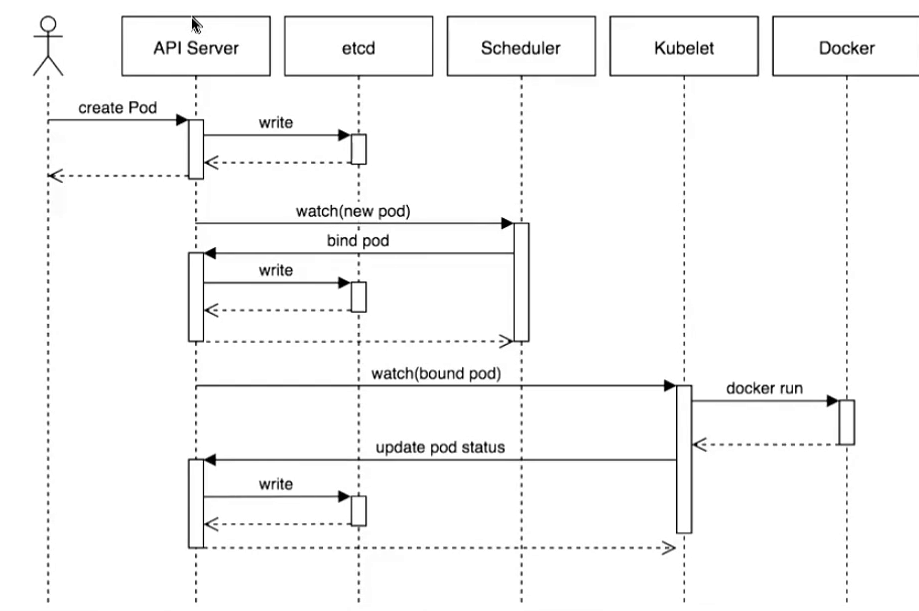

### Pod结束流程

向Api-server 提交删除请求，API-server进行鉴权和准入，并将事件写入到etcd中

Pod状态变成，Terminating 状态 ，从service的endpoints列表中删除，不在接收用户请求，

Pod执行PreStop（删除前动作） 比如删除Pod前执行脚本，把自己从注册中心删掉，

Kubelet向Pod中的容器，发送SIGTER信号（正常终止信号）终止Pod中容器主进程，这个信号会让容器知道自己要被关闭，这个时候就有一个参数可以决定容器多久要被删除了，terminationGracePeriodSeconds（终止宽限期）如果设置了就按照设置的走，默认是30s

kubernetes等待指定的时间称为优雅终止宽跟期,默认情况下是30秒,值得注意的是等待期与prestopHOOK和SIGTERM信号并行执行，即Kubernetes可能不会等待prestop Hock完成(最长30秒之后主进程还没有结束就就强制制终止pod)。

SIGKILL信号被发送到Pod，并删除Pod


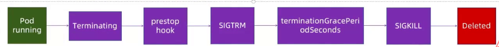

### Pod常见状态

**Unschedulable**:Pod不能被调度，kube-scheduler没有匹配到合适的node节点

​		资源不足，污点，亲和力，反亲和

**podscheculed**:pod正处干调度中，在kube-scheculer刚开始调度的时候，还没有将pod分配到指定的node，在嘴选出合活的节点后就会更新etcd数据，将pod分配到指定的node（基本看不到，调度很快）

**Pending**:正在创建Pod但是Pod中的容器还没有全部被创建完成=[处于此状态的Pod应该检查Pod依赖的存储是否有权限挂载等  比如NFS 找不到 没权限，存储类创建的有问题无法创建挂载。

**Failed:**Pod中有容器启动失败而导致pod工作异常，调度成功，挂载完毕，但容器中配置有问题，或者是配置探针**Unknown**:由于某种原因无法获得pod的当前状态，通常是由于与pod所在的node节点通信错误(很少见)

**init**：配置了Init初始化容器他在进行初始化

**Initialized**:所有pod中的初始化容器已经完成了，

**ImagePullBackOff**:Pod所在的node节点下载镜像失败，网络问题，仓库认证

Running:#Pod内部的容器已经被创建并且启动。
Ready:#表示pod中的容器已经可以提供访问服务

Error:#pod 启动过程中发生错误
NodeLost:#Pod 所在节点失联
Waiting:#Pod 等待启动
Terminating:#Pod 正在被销毁，Pod正在删除中
CrashLoopBackOff:#pod崩溃，但是 ctrl manage 检查到 pod异常 kubelet正在将它重启，配置探针检查失败


InvalidlmageName:#node节点无法解析镜像名称导致的镜像无法下载

lmageInspectError:#无法校验镜像，镜像不完整导致

ErrlmageNeverPull:#策略禁止拉取镜像，镜像中心权限是私有等

RegistryUnavailable:#镜像服务器不可用，网络原因或harbor宕机

ErrlmagePull:#镜像拉取出错，超时或下载被强制终止

createcontainerconfigError:#不能创建kubelet使用的容器配置  文件权限问题

CreateContainerError:#创建容器失败 node环境有问题

RunContainerError:#pod运行失败，容器中没有初始化PID为1的守护进程等，构建镜像时有问题没有前台进程

ContainersNotinitialized:#pod没有初始化完毕

ContainersNotReady:#pod没有准备完毕，只能通过describe 去查看Pod事件，

ContainerCreating:#pod正在创建中

Podlnitializing:#pod正在初始化中

DockerDaemonNotReady:#node节点decker服务没有启动

NetworkPluginNotReady:#网络插件没有启动


### pasue容器

◆Pause 容器，又叫 Infra 容器，是pod的基础容器，镜像体积只有几百KB左右，配置在kubelet中，主要的功能是一个pod中多个容器的网络通信。

◆Infra 容器被创建后会初始化 NetworkNamespace，之后其它容器就可以加入到 Infra 容器中共享Infra 容器的网络了，因此如果一个 Pod 中的两个容器A和 B，那么关系如下:

1.A容器和B容器能够直接使用 localhost 通信;
2.A容器和B容器可以看到网卡、IP与端口监听信息。3.Pod 只有一个 |P 地址，也就是该 Pod 的 Network Namespace 对应的IP 地址(由Infra 容器初始化并创建)。4.k8s环境中的每个Pod有一个独立的IP地址(前提是地址足够用)，并且此IP被当前 Pod 中所有容器在内部共享使用。5.pod删除后Infra 容器随机被删除,其IP被回收。


Pause容器共享的Namespace:
1.NET Namespace:Pod中的多个容器共享同一个网络命名空间，即使用相同的IP和端口信息。
2.IPCNamespace:Pod中的多个容器可以使用SystemVIPC或POSIX消息队列进行通信。
3.UTS Namespace:pod中的多个容器共享一个主机名。MNT Namespace、PiD NamespaceUser Namespace未共享

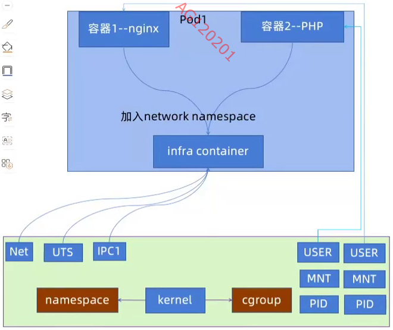

### 网络命名空间（Network Namespace）

在 Linux 系统中，网络命名空间是通过文件系统中的特殊目录来表示的。这些目录通常位于 `/var/run/netns/` 目录下。/var/run/docker/netns/

每个网络命名空间都有一个对应的文件，该文件的名称与命名空间的名称相对应。这个文件实际上是一个符号链接，它链接到 Linux 内核中的网络命名空间。通过操作这个文件，你可以管理对应的网络命名空间，比如执行命令在其中运行程序，配置网络设备等。

例如，如果你有一个名为 `ns1` 的网络命名空间，你可以在 `/var/run/netns/` 目录下找到一个名为 `ns1` 的符号链接文件，它指向内核中的 `ns1` 网络命名空间

**流程大概就是，创建网络命名空间，然后创建虚拟接口，并且把虚拟接口接入到物理网卡上**

是一种 Linux 内核功能，用于创建独立的网络环境，使得在同一台物理主机上可以同时存在多个独立的网络栈。这种技术通常被用于实现容器化技术，比如 Docker、Kubernetes 等。每个网络命名空间都有自己的网络设备、IP 地址、路由表和防火墙规则，使得网络上的不同命名空间之间可以相互隔离。

当你创建一个容器时，典型的容器化平台（如 Docker）会自动为该容器创建一个网络命名空间，并在其中运行容器的网络栈。通常情况下，容器的网络栈会包括一个虚拟接口，该接口连接到该容器所在的网络命名空间内，并通过一对虚拟以太网接口（veth pair）的方式，另一个接口连接到主机的默认网络命名空间中的物理网卡上。

这样设计的目的是为了实现容器与外部网络以及其他容器之间的通信。通过将容器的一个虚拟接口连接到主机的物理网卡上，容器可以与外部网络进行通信。同时，容器内的网络设备也可以与主机上运行的其他容器进行通信，因为它们都位于同一个网络命名空间内，共享相同的网络环境。

1. **网络隔离**：不同的应用程序或容器可以被置于不同的网络命名空间中，彼此之间不受影响，实现网络隔离，增强安全性。
2. **虚拟网络拓扑**：通过创建多个网络命名空间，可以模拟复杂的网络拓扑，比如在同一台物理主机上创建多个虚拟网络，进行网络测试或开发。
3. **网络命名空间之间的通信**：网络命名空间之间可以通过网络设备、路由器等方式进行通信，实现不同网络环境之间的数据交互。
4. **容器化网络**：容器化平台（比如 Docker）通常会使用网络命名空间来隔离容器之间的网络环境，使得不同容器拥有独立的网络栈，相互之间不会干扰。

网络命名空间可以在原本的物理网卡上虚拟出一个或多个接口。每个网络命名空间都有自己的网络设备，这些设备可以是虚拟的，也可以是物理网卡的虚拟接口（比如 VLAN）。这些虚拟接口在网络命名空间内部起作用，与其他网络命名空间中的接口隔离开来，从而实现网络环境的隔离和独立。

**创建命名空间**：首先，通过 `ip netns add` 命令创建一个新的网络命名空间。例如：

```
ip netns add ns1
```

**为命名空间配置网络设备**：接下来，为新创建的命名空间配置网络设备。这包括在命名空间中创建虚拟网络接口，或将现有的物理接口移动到该命名空间中。可以使用 `ip link` 命令完成这一步骤。例如：

这将创建一对虚拟以太网接口 `veth0` 和 `veth0-peer`，并将 `veth0` 移动到 `ns1` 命名空间中。

```
ip link add veth0 type veth peer name veth0-peer
ip link set veth0 netns ns1
```

**配置网络参数**：在命名空间内部配置网络参数，包括 IP 地址、路由等。可以通过在命名空间中执行命令来完成这些配置。例如：

这将为 `ns1` 命名空间中的 `veth0` 接口分配 IP 地址，并启用该接口

```
ip netns exec ns1 ip addr add 192.168.1.1/24 dev veth0
ip netns exec ns1 ip link set dev veth0 up
```

**配置路由规则**：如果需要，可以在命名空间内部配置路由规则，以定义数据包的传输路径。例如：这将添加一个默认路由，将数据包发送到指定的网关。

```
ip netns exec ns1 ip route add default via 192.168.1.254
```

创建网络命名空间和虚拟接口是网络隔离的基础。网络命名空间允许您在同一台物理主机上创建多个独立的网络栈，而虚拟接口允许这些命名空间内的网络设备与其他网络设备进行通信。这两者的结合使得不同命名空间之间可以相互隔离并与外部网络通信。

至于为什么要将虚拟接口接入物理网卡，这是因为物理网卡是连接主机与外部网络的通道。通过将虚拟接口连接到物理网卡，网络命名空间内的应用程序可以与外部网络通信，例如访问互联网或与其他主机通信。否则，虽然命名空间内的网络设备可以彼此通信，但它们无法与外部网络通信，因为它们无法直接连接到外部网络。

因此，将虚拟接口接入物理网卡是为了实现网络命名空间内外的互联互通，使得命名空间内的应用程序可以与外部世界进行通信。

创建一对网络接口的目的是为了实现网络命名空间内外的通信。其中一个接口放在网络命名空间中，使得命名空间内的网络设备可以使用该接口与其他命名空间内的设备通信。而另一个接口则连接到物理网卡上，使得网络命名空间内的设备可以与外部网络通信。

这对接口通常被称为 "veth pair"，其中一个接口在命名空间内被命名为 `veth0`（或其他名称），另一个接口则在主机的默认网络命名空间中，通常被命名为 `veth0-peer`（或其他名称）。这样，命名空间内的设备可以通过 `veth0` 接口与外部通信，而外部设备则可以通过 `veth0-peer` 接口与命名空间内的设备通信。


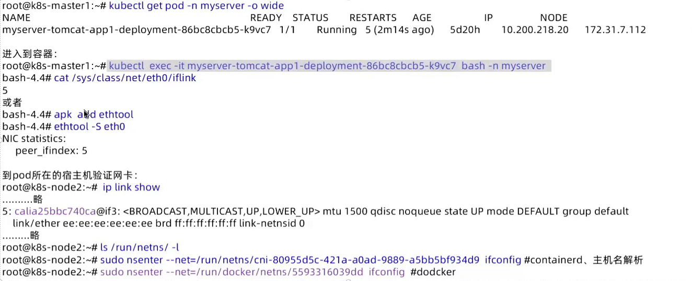


### Pause容器 配置实例

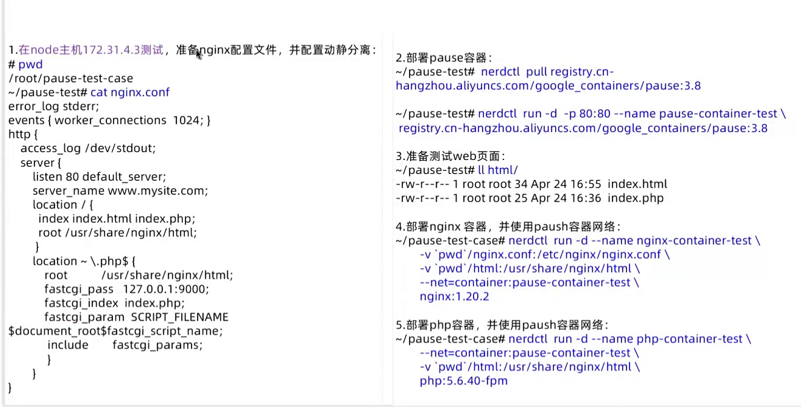


### init 容器

**init容器的作用:**
1.可以为业务容器提前准备好业务容器的运行环境，比如将业务容器需要的配置文件提前生成
并放在指定位置、检查数据权限或完整性、软件版本等基础运行环境。
2.可以在运行业务容器之前准备好需要的业务数据，比如从OSS下载、或者从其它位置coPy。
3.检查依赖的服务是否能够访问。


**init容器的特点:**
1.一个pod可以有多个业务容器还能在有多个init容器，但是每个init容器和业务容器的运行环境都是隔离的。
2.init容器会比业务容器先启动。
3.init容器运行成功之后才会继续运行业务容器。
4.如果一个pod有多个init容器，则需要从上到下逐个运行并且全部成功，最后才会运行业务容器。
5.init容器不支持探针检测(因为初始化完成后就退出再也不运行了)。

init1负责数据准备，init2负责权限，业务容器起来直接运行


单容器共享一个存储，

多容器共享一个挂载存储，比如说两个容器，一个给存储写数据，一个容器读取数据，比如日志收集

多容器多个挂载，


#### Pod的健康状态监测机制

1. **Startup Probe**（启动探针）： 阻塞其他探针
   - **作用**：用于检查容器是否已经启动并且是否可以开始接受请求。与 Liveness 和 Readiness 探针不同，Startup 探针只在容器首次启动时执行，并且不会在容器重启时再次执行。
   - **场景**：适用于需要一些额外的初始化时间的容器，例如在启动过程中需要加载大量数据或配置文件的情况。
2. **Liveness Probe**（存活性探针）：
   - **作用**：用于检查容器是否正在运行。如果 Liveness 探针失败（即容器未响应），Kubernetes 将尝试重新启动容器。
   - **场景**：用于检测容器是否出现了某种无法自行修复的问题，例如死锁或无限循环。当容器出现这些问题时，Liveness 探针会将容器标记为不健康，并尝试重新启动。
3. **Readiness Probe**（就绪性探针）：
   - **作用**：用于检查容器是否已经准备好接受流量。只有当 Readiness 探针成功后，Kubernetes 才会将该容器的 IP 地址添加到服务的负载均衡池中，从而开始向该容器转发流量。如果探测失败会从Service后端real server列表摘下来，并不会重启容器。
   - **场景**：适用于需要在容器完全启动并且应用程序已准备好处理流量之前，避免将流量发送到容器的情况。例如，当应用程序需要加载大量数据或与其他服务建立连接时，可以使用 Readiness 探针来确保容器已经准备好接收流量


### pod探针

Health Check：

由发起者对容器进行周期性健康状态检测周期检测

相当于人类的周期性体检

每次检测相当于人类每次体检的内容

**Docker Health Check：**

部分

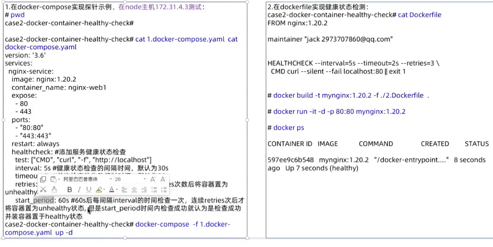


#### 探针类型

Pod支持的监测类型

◼ startup Probe

◼ liveness Probe

◼ readiness Probe

监测机制

◼ Exec Action：根据指定命令的结果状态码判定

◼ TcpSocket Action：根据相应TCP套接字连接建立状态判定

◼ HTTPGet Action：根据指定https/http服务URL的响应结果判定

配置参数

◼ initialDelaySeconds：容器启动后多久开始执行探测，默认为 0。（容器中的程序可能非常大，启动很慢，如果不给他一个足够的时间启动，那么会造成死循环，在他没起来的时候探测都是失败的，然后一直重启）

◼ periodSeconds：探测之间的间隔时间。

◼ timeoutSeconds：单次探测的超时时长 

◼ successThreshold：成功阈值

◼ failureThreshold：失败阈值，连续失败多少次后标记为失败，默认为 3


**startupProbe**:启动探针,kubernetes v1.16引入

判断容器内的应用程序是否已启动完成，如果配置了启动探测，则会先禁用所有其它的探测，直到startupProbe检测成功为止，如果staruoProbe探测失败，则kubelet将杀死容器，容器将按照重启策略进行下一步操作，如果容器没有提供启动探测，则默认状态为成功

**livenessProbe:**存活探针
检测容器容器是否正在运行，如果存活探测失败，则kubelet会杀死容器，并且容器将受到其重启策略的影响，如果容器不提供存活探针，则默认状态为 Success，livenessProbe用于控制是否重启pod。

**readinessProbe**:就绪探针
-如果就绪探测失败，端点控制器将从与Pod匹配的所有Service的端点中删除该Pod的IP地址，初始延迟之前的就绪状态默认为Failure(失败)，如果容器不提供就绪探针，则默认状态为 Success，readinessProbe用于控制pod是否添加至service。


有三种探针，每个探针都有三种探测方式

探针是由 kubelet 对容器执行的定期诊断，以保证Pod的状态始终处于运行状态，要执行诊断，kubelet调用由容器实现的Handler(处理程序)，也成为Hook(钩子)，有三种类型的处理程序:

**ExecAction** #在容器内执行指定命令，如果命令退出时返回码为0则认为诊断成功。
**TCPSocketAction** #对指定端口上的容器的IP地址进行TCP检查，如果端口打开，则诊断被认为是成功的。
**HTTPGetAction**:#对指定的端口和路径上的容器的IP地址执行HTTPGet请求，如果响应的状态码大于等于200且小于 400，则诊断被认为是成功的
每次探测都将获得以下三种结果之一
成功:容器通过了诊断。
失败:容器未通过诊断
未知:诊断失败，因此不会采取任何行动，

HTTP 探测器可以在 httpGet 上配置额外的字段:
host: #连接使用的主机名，默认是Pod的IP，也可以在HTTP头中设置“Host”来代替。
scheme: http #用于设置连接主机的方式(HTTP 还是 HTTPS)，默认是 HTTP.
path:/monitor/index.html#访问 HTTP 服务的路径,
httpHeaders:#请求中自定义的 HTTP 头,HTTP 头字段允许重复。
port: 80#访问容器的端口号或者端口名，如果数字必须在1~65535 之间。


探针有很多配置字段，可以使用这些字段精确的控制存活和就绪检测的行为:

https://kubernetes.io/zh/docs/tasks/configure-pod-container/configure-liveness-readiness-startup-probes/

initialDelaySeconds:120
#初始化延迟时间，告诉kubelet在执行第一次探测前应该等待多少秒，默认是0秒，最小值是0

periodSeconds:60~#探测周期间隔时间，指定了kubelet应该每多少秒秒执行一次存活探测，默认是10秒。最小值是1
timeoutSeconds:5#单次探测超时时间，探测的超时后等待多少秒，默认值是1秒，最小值是1。

successThreshold:1
#从失败转为成功的重试次数，探测器在失败后，被视为成功的最小连续成功数，默认值是1，存活探测的这个值必须是1，最小值是1。

failureThreshold:3~#从成功转为失败的重试次数，当Pod启动了并且探测到失败，Kubernetes的重试次数，存活探测情况下的放弃就意味着重新启动容器，就绪探测情况下的放弃Pod 会被打上未就绪的标签，默认值是3，最小值是1。


#### Pod重启策略

Pod一旦配置探针，在检测失败时候，会基于restartPolicy对Pod进行下一步操作:

restartPolicy(容器重启策略):

Always:当容器异常时，k8s自动重启该容器Replicatiorontroller/Replicaset/Deployment，默认为Always。

OnFailure:当容器失败时(容器停止运行且退出码不为0)，k8s自动重启该容器。

Never:不论容器运行状态如何都不会重启该容器Job或Cronjob

**imagePullPolicy(镜像拉取策略):**

IfNotPresent:node节点没有此镜像就去指定的镜像仓库拉取node有就使用node本地镜像。

Always:每次重建pod都会重新拉取镜像

Never:从不到镜像中心拉取镜像，只使用本地镜像


**探针最核心的功能：**

 1.探针检查失败后，可以将pod从svc中摘除，新的请求不会再转发给检查失败的pod

 2.探针检查失败后，可以重启pod

```yaml
apiVersion: apps/v1
kind: Deployment
metadata:
  name: myapp-deployment
  namespace: myapp
spec:
  replicas: 1
  selector:
    matchLabels:
      app: 2024-myapp-nginx
  template:
    metadata:
      labels:
        app: 2024-myapp-nginx
    spec:
      containers:
      - name: lxj
        image: nginx:1.20.2
        imagePullPolicy: IfNotPresent
        ports:
        - containerPort: 80
        readinessProbe: #就绪探针探测失败后将会标记为不可用service下线 访问不到
       #livenessProbe:  #存活探针探测失败后重启
          #tcpSocket
          #   port: 80
           httpGet:
              path: /index.html
              port: 80
          #容器启动后里面的服务可能要一段时间才能起来 我们得等他起来才能进行探测 给他一点时间启动然后进行探测 不然他没起来我们就探测失败 然后一致重启
          initialDelaySeconds: 120
          periodSeconds: 3    #在容器启动后每隔n秒检测一次
          timeoutSeconds: 5   #单次探测超时 5秒不给我响应就算失败
          successThreshold: 1 #检查成功一次就算成功(启动和存活必须是1)
          failureThreshold: 3  #探测失败多少次从成功转为失败
---
apiVersion: v1
kind: Service
metadata:
  name: myapp-server
  namespace: myapp
spec:
  ports:
  - name: http
    port: 81
    targetPort: 80
    nodePort: 30001
    protocol: TCP
  type: NodePort
  selector:
    app: 2024-myapp-nginx
```


```yaml
apiVersion: apps/v1
kind: Deployment
metadata:
  name: deploy-myapp
  namespace: myapp
spec:
  replicas: 1
  selector:
    matchLabels:
      app: ggbang
  template:
    metadata:
      labels:
        app: ggbang
    spec:
      containers:
      - name: myapp-ggbang
        image: nginx:1.20.2
        ports:
        - containerPort: 80
        startupProbe: #启动时探测一次 后面就不会探测了 失败后按照重启策略重启
          httpGet:
            path: /index.html
            port: 81
          initialDelaySeconds: 5
          failureThreshold: 3
          periodSeconds: 3
#重启重启的时候 名字不变IP不变  当里面的文件会还原  基于源镜像恢复快照还原并不会完全重新创建
```


```
Container Probe (探测): 周期性向容器发起探测请求
            StartupProbe
            LivenessProbe：存活状态，用于判定容器进程是否健康运行；
                影响：判定为不健康的Pod，会被kubelet根据重启策略进行处理，重启；
            ReadinessProbe：就绪状态，用于判定容器进程是否已经初始化完成，并可向用户提供服务；
                影响：判定为未就绪的Pod，以该Pod为后端端点的Service，不予调度流量给该Pod；

            成功阈值：1
                failure状态下，满足连续success的次数之后，即被判定为成功；
            失败阈值：3

            探测的方式：
                tcpSocket
                httpGet
                exec：运行此处自定义的命令，根据命令的退出码，来判定其健康状态；


Startup Probe 主要用于确定容器是否已经准备好接收请求，并且只会在容器首次启动时执行。如果容器在启动时 Startup Probe 失败，则 Kubernetes 将认为容器启动失败，但它不会触发 Pod 的重启。

Liveness Probe 用于检查容器是否处于运行状态，如果 Liveness Probe 失败，则 Kubernetes 将尝试重新启动容器。而 Readiness Probe 用于检查容器是否准备好接收流量，如果 Readiness Probe 失败，则容器将被从服务负载均衡中移除，但它并不会触发 Pod 的重启。

```


#### 无法连接到自建harbord的解决办法


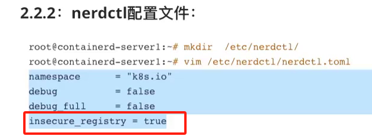


#### containerd 默认寻找CNI的路径

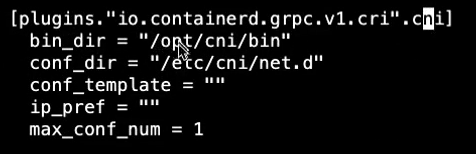


## **job** 

job和Cronjob这类任务都是严重依赖于时间的，我们需要把master节点的时间对准，然后把master的和node时间挂载到 ctrlmanage api server和 scheduler 容器内，如果使用kubeadm以容器的方式安装的


数据导入执行一次就删除  持久化我们一般是挂存储，因为挂本地的话不一定挂到那个主机上

```yaml
apiVersion: batch/v1
kind: Job
metadata:
  name: job-mysql-init
spec:
  template:
    spec:
      containers:
      - name: job-mysql-init-container
        image: centos:7.9.2009
        command: ["/bin/sh"]
        args: ["-c", "echo data init job at `date +%Y-%m-%d_%H-%M-%S` >> /cache/data.log"]
        volumeMounts:
        - mountPath: /cache
          name: cache-volume
      volumes:
      - name: cache-volume
        hostPath:
          path: /tmp/jobdata
      restartPolicy: Never
```


## **CronJob**

执行一次退出，删掉容器，下次执行再新建一个 周期任务

默认保存三个旧版本，滚动执行

```yaml
apiVersion: batch/v1
kind: CronJob
metadata:
  name: cronjob-mysql-databackup
spec:
  #schedule: "30 2 * * *"
  schedule: "* * * * *"
  jobTemplate:
    spec:
      template:
        spec:
          containers:
          - name: cronjob-mysql-databackup-pod
            image: centos:7.9.2009
            #imagePullPolicy: IfNotPresent
            command: ["/bin/sh"]
            args: ["-c", "echo mysql databackup cronjob at `date +%Y-%m-%d_%H-%M-%S` >> /cache/data.log"]
            volumeMounts: 
            - mountPath: /cache
              name: cache-volume
          volumes:
          - name: cache-volume
            hostPath:
              path: /tmp/cronjobdata
          restartPolicy: OnFailure

```


## RC/RS 副本控制器：

**Replication controller** :第一代副本控制器  只支持 selector =  ！=精确匹配

```
apiVersion: v1  
kind: ReplicationController  
metadata:  
  name: ng-rc
spec:  
  replicas: 2
  selector:  
    app: ng-rc-80 
    #app1: ng-rc-81
  template:   
    metadata:  
      labels:  
        app: ng-rc-80
        #app1: ng-rc-81
    spec:  
      containers:  
      - name: ng-rc-80 
        image: nginx  
        ports:  
        - containerPort: 80 
```


**ReplicaSe**t 第二代副本控制器 支持selector  还支持 in  notin

模糊匹配一半用的较少，因为会莫名其妙会把别的pod加进来，所以要对服务器上所有Pod的标签了解

```yml
#apiVersion: extensions/v1beta1
apiVersion: apps/v1 
kind: ReplicaSet
metadata:
  name: frontend
spec:
  replicas: 2
  selector:
    #matchLabels:
    #  app: ng-rs-80
    matchExpressions:
      - {key: app, operator: In, values: [ng-rs-80,ng-rs-81]}
  template:
    metadata:
      labels:
        app: ng-rs-80
    spec:  
      containers:  
      - name: ng-rs-80 
        image: nginx  
        ports:  
        - containerPort: 80
```


## **Deployment**

无状态服务

不论Rc还是Rs，他只是帮我们控制Pod的副本数量，很少单独使用。

它除了有Rs的功能之外还被赋予了更高级的功能，滚动，回滚，暂停


在更新时，deployment会在拉一个新的ReplicaSet 启动一个新的Pod ，然后删除一个旧的Pod

然后把一部分流量转到新版pod中

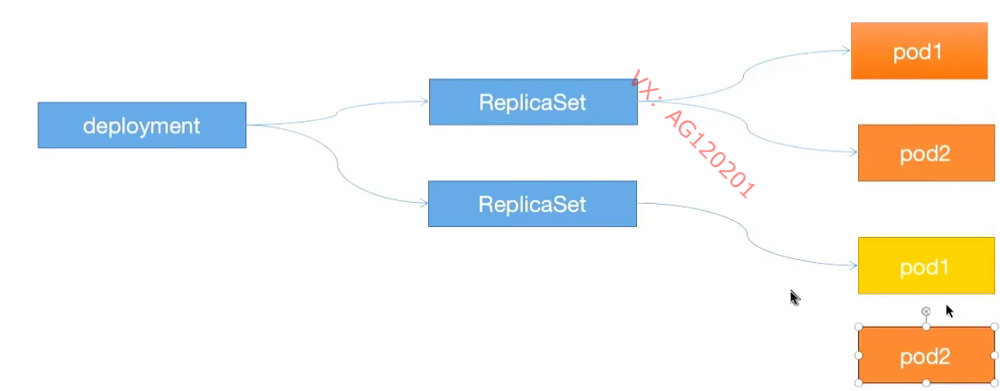

示例：

```yaml
apiVersion: apps/v1
kind: Deployment
metadata:
  name: nginx-deployment
spec:
  replicas: 2
  selector:
    #app: ng-deploy-80 #rc
    matchLabels: #rs or deployment
    #  app: ng-deploy-80
    
    matchExpressions:
      - {key: app, operator: In, values: [ng-deploy-80,ng-rs-81]}
  template:
    metadata:
      labels:
        app: ng-deploy-80
    spec:
      containers:
      - name: ng-deploy-80
        image: nginx
        ports:
        - containerPort: 80
```

除了标签之外，在 `spec.template` 中还可以定义以下内容：

1. **镜像（image）**：指定要在 Pod 中运行的容器的镜像及其版本。
2. **容器（containers）**：定义要在 Pod 中运行的一个或多个容器的规范，包括名称、镜像、端口、环境变量、命令等。
3. **卷挂载（volumes）**：指定要挂载到容器中的卷，包括持久卷、空目录卷等。
4. **环境变量（environment variables）**：定义容器中的环境变量。
5. **命令和参数（command and args）**：定义容器启动时执行的命令和参数。
6. **健康检查（liveness and readiness probes）**：定义容器的健康检查配置，包括检查路径、端口、超时等。
7. **资源限制（resource limits）**：指定容器可使用的 CPU 和内存资源的限制。
8. **容器安全上下文（security context）**：定义容器的安全上下文，包括用户、组、特权等。
9. **节点亲和性和污点容忍性（node affinity and taint tolerations）**：定义 Pod 对节点的偏好和容忍性。
10. **服务账号（service account）**：指定 Pod 中使用的服务账号。
11. **DNS 配置（DNS configuration）**：配置 Pod 的 DNS 解析策略和 DNS 搜索域。
12. **主机网络配置（host networking configuration）**：配置 Pod 是否使用宿主机的网络命名空间。
13. **主机卷配置（host volume configuration）**：配置 Pod 是否使用宿主机的文件系


```bash
#查看历史版本
kubectl rollout history deployment -n <name>  <Deployment name>
#回滚历史版本  如果不指定 --to-revision，则默认回滚到上一个版本
kubectl rollout undo deployment <deployment-name>
#回滚到上一个版本，可以使用 --to-revision 标志来指定要回滚到的修订版本号。例如：
kubectl rollout undo deployment <deployment-name> --to-revision=<revision-number>
```


## 灰度发布 没讲

用传统Rc控制器创建的Pod，我们想更新版本，去修改yaml中的镜像为新版，然后重新 apply一下

此时我们发现，旧版的Pod不会自动删除 ，也不会新建，

我们必须删除旧版，然后创建新版，不支持滚动更新，这是很危险的动作，我们删除旧版Pod就代表服务全部不可用，而且不支持回滚


在Deployment更新时 可以调整在更新时，最多 多出几个副本，最少 有几个副本  来控制更新的粒度，或者实现不同的更新模式

在 Kubernetes 的 Deployment 更新过程中，你可以使用 `spec.strategy.rollingUpdate.maxSurge` 字段来控制更新期间可以额外创建的副本数量。这个字段指定了在更新过程中允许的额外副本数，它可以帮助你调整更新的力度。

例如，如果你将 `maxSurge` 设置为 25%，那么在更新过程中，Kubernetes 将会比当前的副本数量多创建 25% 的额外副本，以便在新版本的 Pod 启动之后确保系统的稳定性。这样可以在更新过程中确保有足够的额外资源来处理负载，并且在更新完成后逐步回收多余的副本。

1. **灰度发布（Gradual Rollout）**：
   - 通过逐步将新版本的 Pod 逐渐引入生产环境，可以降低风险并允许在发布过程中进行监控和测试。
   - 可以通过逐步增加 Deployment 的副本数，或者将新版本的 Pod 分配给一部分流量，逐步增加到整个应用程序的流量。
   - 使用 Deployment 的 `spec.strategy.rollingUpdate.maxSurge` 和 `spec.strategy.rollingUpdate.maxUnavailable` 字段可以控制滚动更新过程中旧版本和新版本 Pod 的数量。
2. **金丝雀发布（Canary Release）**：
   - 在生产环境中先引入一小部分用户流量到新版本，以便在实际用户中测试新功能。
   - 可以使用 Deployment 的多个副本集来实现金丝雀发布，例如创建一个新的 ReplicaSet，将其标记为金丝雀版本，并将一部分流量路由到这个 ReplicaSet。
   - 监控新版本的性能和稳定性，根据反馈逐步增加流量，或者在发现问题时回滚到旧版本。
3. **滚动更新（Rolling Update）**：
   - 通过逐步替换旧版本的 Pod，可以实现应用程序的滚动更新，确保在更新过程中服务的可用性。
   - 使用 Deployment 的滚动更新策略，可以配置更新过程中同时可用的最大副本数、最小就绪时间等参数，以平衡更新速度和服务稳定性。
   - 监控更新过程中的指标，并根据情况调整更新策略，确保更新过程顺利进行。

通过结合 Deployment 的滚动更新策略、标签选择器、服务和 Ingress 资源等 Kubernetes 特性，可以实现灵活且可控的灰度发布、金丝雀发布和滚动更新策略，以适应不同的应用程序和业务需求。


示例

```yml
apiVersion: apps/v1
kind: Deployment
metadata:
  name: my-app
spec:
  replicas: 5  # 设置生产环境的副本数量
  selector:
    matchLabels:
      app: my-app
  strategy:
    rollingUpdate:
      maxSurge: 1  # 指定在更新过程中允许的最大 Surge 数量
      maxUnavailable: 1  # 指定在更新过程中允许的最大不可用 Pod 数量
    type: RollingUpdate
  template:
    metadata:
      labels:
        app: my-app
    spec:
      containers:
      - name: my-app
        image: my-app:latest  # 生产环境的镜像版本
        ports:
        - containerPort: 80
```


## Statefulset

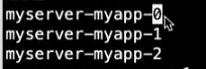

每个Pod都有自己的角色（比如master  slave）

​	固定的唯一网络标识符

​	比如从节点找主节点sync数据，主节点要有一个不变的标识，当pod重建IP会变，但他的名字不会变这就是他的网络标识符

每个Pod都有自己的数据

每个Pod分配不同的存储   PV/PVC

按顺序部署，删除也是


Statefulset为了解决有状态服务的集群部署、集群之间的数据同步问题(MySQL主从、Redis Custer、Es集群等）

Statefulset所管理的Pod拥有唯一日固定的Pod名称Statefulset按照顺序对pod进行启停、伸缩和回收

Headless Services(无头服务，请求的解析直接解析到pod IP) 后端Pod轮询调度，负载均衡，


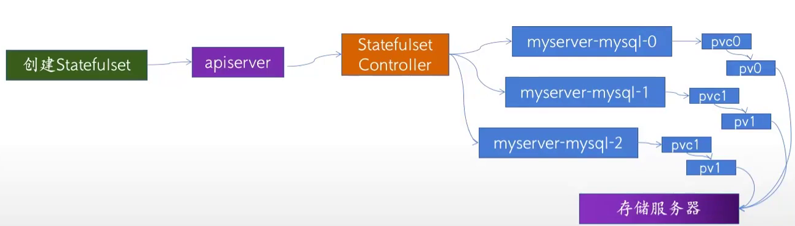


```yaml
---
apiVersion: apps/v1
kind: StatefulSet 
metadata:
  name: myserver-myapp
  namespace: myserver
spec:
  replicas: 3
  serviceName: "myserver-myapp-service"
  selector:
    matchLabels:
      app: myserver-myapp-frontend
  template:
    metadata:
      labels:
        app: myserver-myapp-frontend
    spec:
      containers:
      - name: myserver-myapp-frontend
        image: nginx:1.20.2-alpine 
        ports:
          - containerPort: 80

---
apiVersion: v1
kind: Service
metadata:
  name: myserver-myapp-service
  namespace: myserver
spec:
  clusterIP: None
  ports:
  - name: http
    port: 80
  selector:
    app: myserver-myapp-frontend 

```


## Deament Set

可以用Deament Set在那个节点部署一个nginx 不管前端调度到那个节点，都有nginx不用server转发

DaemonSet 在当前集群中每个节点运行同一个pod，

当有新的节点加入集群时也会为新的节点配置相同的pod，

当节点从集群中移除时其pod也会被kubernetes回收，删除DaemonSet控制器将删除其创建的所有的pod。


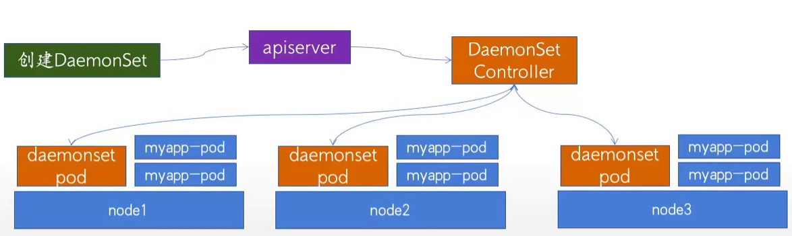


## Service

有些公司使用 nacos 等注册中心也可以，再没有使用注册中心的情况下，

A Pod  调用 B pod，Pod重建后IP地址变幻莫测，Pod之间可能存在互相访问失败的问题

而service则解耦了服务和应用，Service是靠标签选择器，动态匹配后端的endpoint


当你创建一个类型为 NodePort 的 Service 时，Kubernetes 会在每个节点上监听同一个端口，从而允许你通过任何节点的 IP 地址和该端口来访问 Service。

具体来说，当你创建一个 NodePort 类型的 Service 时，Kubernetes 会自动为该 Service 分配一个端口（NodePort），通常在范围 30000-32767 内。然后，Kubernetes 在每个节点上监听这个指定的 NodePort，并将到达该端口的流量转发到 Service 中的 Pod。


同时他也可以所谓，k8s内部的负载均衡器，他有一个cluster IP：port

我们访问cluster IP：port 他就会调度到后端被标签选择到的Pod

tyep ：  Cluster IP 仅在K8s内中使用	

​			  Nodeport、 通过宿主机访问k8s中pod的服务

​			  LoadBalancer、 公有云结合LSB/Nodeport/Cluster IP/ Pod IP

​			  ExternalName、通过域名访问，运行在K8s环境以外的服务，


客户端访问 SLB公网地址，SLB往后调度，后面三个服务器某个 IP：port   

Svc 绑定 节点 端口，因此访问节点 ip 某个端口就是直接SVC 再调度到后台Pod

为什么nodeport 不直接调度到Pod ，因为Node Port没有动态匹配Pod的能力，他不知道Pod在哪里。

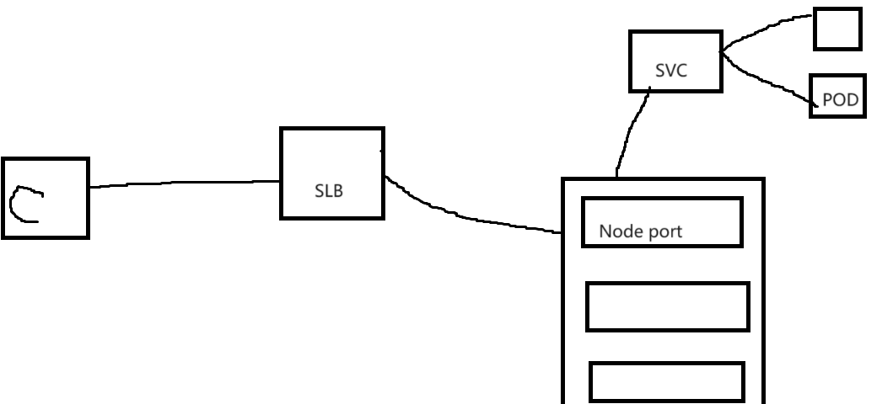

示例：

**ClusterIP**

```yml
apiVersion: v1
kind: Service
metadata:
  name: ng-deploy-80 
spec:
  ports:
  - name: http
    port: 80
    targetPort: 80
    protocol: TCP
  type: ClusterIP
  clusterIP: 10.100.21.199
  selector:
    app: ng-deploy-80
```


**NodePort**

防火墙把请求转发给 负载均衡的VIP ，然后负载均衡器调度到后端 type: NodePort

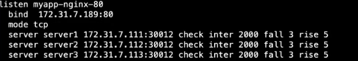

```yaml
apiVersion: v1
kind: Service
metadata:
  name: ng-deploy-80 
spec:
  ports:
  - name: http
    port: 81
    targetPort: 80
    nodePort: 30012
    protocol: TCP
  type: NodePort
  selector:
    app: ng-deploy-80
```


## Volume 存储卷

从概念上讲，存储卷是可供Pod中的所有容器访问的**目录**

Pod规范中声明的**存储卷来源**决定了目录的创建方式、使用的存储介质以及目录的初始内容

存储卷插件（存储驱动）决定了支持的后端存储介质或存储服务，例如hostPath插件使用宿主机文件系统，而nfs插件则对接指定的NFS存储服务等

Pod在规范中需要指定其包含的卷以及这些卷在容器中的挂载路径

它定义在Pod上，因而生命周期与Pod相同，这意味着

◆Pod中的所有卷都是在创建Pod时一并被创建

◆删除Pod时，其上的所有卷亦会同时被删除

**卷的使用方法**

◼ 一个Pod 可以附带多个卷，其每个容器可以在不同位置按需挂载Pod上的任意卷，或者不挂载任何卷

◼ Pod上的某个卷，也可以同时被该Pod内的多个容器同时挂载，以共享数据

◼ 如果支持，多个Pod也可以通过卷接口访问同一个后端存储单元


```
in-Tree存储卷插件
◼ 临时存储卷
  ◆emptyDir
◼ 节点本地存储卷
  ◆hostPath, local
◼ 网络存储卷
  ◆文件系统：NFS、GlusterFS、CephFS和Cinder
  ◆块设备：iSCSI、FC、RBD和vSphereVolume
  ◆存储平台：Quobyte、PortworxVolume、StorageOS和ScaleIO
  ◆云存储：awsElasticBlockStore、gcePersistentDisk、azureDisk和azureFile
◼ 特殊存储卷
  ◆Secret、ConfigMap、DownwardAPI和Projected
◼ 扩展接口
  ◆CSI和FlexVolume
Out-of-Tree存储卷插件
◼ 经由CSI或FlexVolume接口扩展出的存储系统称为Out-of-Tree类的存储插件
```

将业务数据和容器解耦，把容器内的数据存储到指定的位置，不同的存储卷功能不一样，如果是网络存储的话，可以实现容器间的数据共享和持久化 

静态存储卷和动态存储卷

kubelet 在node节点上完成pod初始化 他会从api server上拿到比如 镜像地址，挂载信息

 **emptyDir**：本地临时  Pod在那个主机，这个目录就会创建在那个主机，意味着容器删除，这个目录就会被删除，

 **hostPath**：本地存储   把宿主机的某些目录挂载到容器内，类似于 Docker中 -v ，这种类型容器删除卷不会被删除，在K8s中Node 节点是一个巨大的资源池，我们不会强制要求一个Pod 运行在固定的Node上

多个节点组织成一个巨大的资源池，以实现高效的容器化应用程序部署和管理，我们不能因为hostPath的缘故把一个Pod 强行锁死在一个node节点上，比如这次运行在node1上，数据存在Node1，但重建Pod要是运行在Node2上，那么之前的数据就没了，而且这次的数据会存在node2上 。因此我们就必须让他运行在node1上

如果这个主机挂了，那我们的Pod 和数据就都没有了，所以我们不能锁死Pod的运行节点。


**ConfigMap**  配置中心，打镜像的时候可以不把配置打进去，配置和镜像服务解耦，创建容器时以ConfigMap的方式提供配置

**Secret**    密钥密码，base64加密，并不安全

**nfs** 网络存储


**存储卷资源规范**

 通过.spec.volumes字段定义在Pod之上的存储卷列表，它经由特定的存储卷插件并结合特定的存储供给方的访接口进行定义

嵌套定义在容器的volumeMounts字段上的存储卷挂载列表，它只能挂载当前Pod对象中定义的存储卷

```
spec:
  volumes:
  - name: <string>
    # 卷名称标识，仅可使用 DNS 标签格式的字符，在当前 Pod 中必须唯一；
    VOL_TYPE: <Object>
    # 存储卷插件及具体的目标存储供给方的相关配置；
    
  
  containers:
  - name: ...
    image: ...
    volumeMounts:
    - name: <string>
      # 要挂载的存储卷的名称，必须匹配存储卷列表中某项的定义；
      mountPath: <string>
      # 容器文件系统上的挂载点路径；
      readOnly: <boolean>
      # 是否挂载为只读模式，默认为否；
      subPath: <string>
      # 挂载存储卷上的一个子目录至指定的挂载点；
      subPathExpr: <string>
      # 挂载由指定的模式匹配到的存储卷的文件或目录至挂载点；
      mountPropagation: <string>
      # 挂载卷的传播模式；
```


示例

###  **emptyDir**

```yml
volumes:
- name: data
  emptyDir:
  medium: Memory
  sizeLimit: 16Mi

# medium：此目录所在的存储介质的类型，可用值为“default”或“Memory
#sizeLimit：当前存储卷的空间限额，默认值为nil，表示不限制
```


df 命令查看不到 因为他只是个目录

当Pod被分配给节点时，首先创建emptyDir卷，并且只要该Pod 在该节点上运行，该卷就会存在，正如卷的名字所述，它最初是空的，Pod中的容器可以读取和写入 emptyDir 卷中的相同文件，尽管该卷可以挂载到每个容器中的相同或不同路径上。当出于任何原因从节点中删除 Pod 时，emptyDir 中的数据将被永久删除。

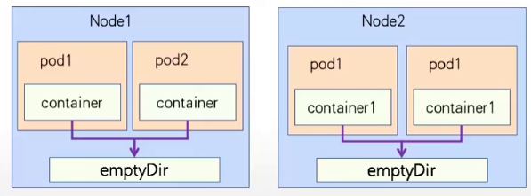

```yaml
apiVersion: apps/v1
kind: Deployment
metadata:
  name: nginx-deployment
spec:
  replicas: 1
  selector:
    matchLabels: #rs or deployment
      app: ng-deploy-80
  template:
    metadata:
      labels:
        app: ng-deploy-80
    spec:
      containers:
      - name: ng-deploy-80
        image: nginx 
        ports:
        - containerPort: 80
        volumeMounts:
        - mountPath: /cache
          name: cache-volume
      volumes:
      - name: cache-volume
        emptyDir: {}
```


###  **hostPath:**

**将Pod所在节点上的文件系统的某目录用作存储卷，数据的生命周期与节点相同**

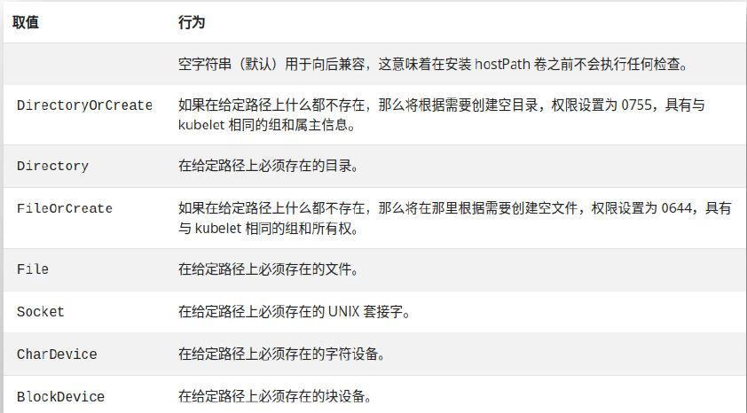

卷将主机节点的文件系统中的文件或目录挂载到集群中，pod删除的时候，卷不会被删除

如果你能保证你的Pod 一直运行在某个节点， 不能实现高可用啊 挂了不能再别的节点调度

目录不存在kubelet会自己创建 

```yaml
apiVersion: apps/v1
kind: Deployment
metadata:
  name: nginx-deployment
spec:
  replicas: 1
  selector:
    matchLabels:
      app: ng-deploy-80
  template:
    metadata:
      labels:
        app: ng-deploy-80
    spec:
      containers:
      - name: ng-deploy-80
        image: nginx 
        ports:
        - containerPort: 80
        volumeMounts:
        - mountPath: /cache
          name: cache-volume
      volumes:
      - name: cache-volume
        hostPath:
          path: /data/kubernetes
          type: DirectoryOrCreate
          
---
apiVersion: v1
kind: Pod
metadata:
  name: volumes-hostpath-demo
  labels:
    app: redis
spec:
  containers:
  - name: redis
    image: redis:alpine
    ports:
    - containerPort: 6379
      name: redisport
    securityContext:
      runAsUser: 999
    volumeMounts:
    - mountPath: /data
      name: redisdata
  volumes:
  - name: redisdata
    hostPath:
      path: /appsdata/redis/
      type: DirectoryOrCreate

```


###  **ConfigMap**

注意：修改默认不支持实时更新，安装监听器插件 Configmap reloader 

将一些非机密信息，通常都是配置信息，各种conf文件，以挂载的形式，挂载到容器内某个目录下

（和NFS挂载不同， 创建容器时，kubelet从api server etcd下载到运行Pod容器的node节点，在使用unfs和其他目录一起挂载到容器）

通常小于 1MB

在创建容器前，先创建comfimap，通常和你调用的容器在同一个名称空间下

可以有多个Kye 调用时指定某个Key

```yaml
apiVersion: v1
kind: ConfigMap
metadata:
  name: nginx-config
data:
 default: |
    server {
       listen       80;
       server_name  www.mysite.com;
       index        index.html index.php index.htm;

       location / {
           root /data/nginx/html;
           if (!-e $request_filename) {
               rewrite ^/(.*) /index.html last;
           }
       }
    }


---
#apiVersion: extensions/v1beta1
apiVersion: apps/v1
kind: Deployment
metadata:
  name: nginx-deployment
spec:
  replicas: 1
  selector:
    matchLabels:
      app: ng-deploy-80
  template:
    metadata:
      labels:
        app: ng-deploy-80
    spec:
      containers:
      - name: ng-deploy-80
        image: nginx:1.20.0
        ports:
        - containerPort: 80   #描述性表示告诉看这个yaml文件的人 这个容器会监听80
        volumeMounts:
        - mountPath: /data/nginx/html
          name: nginx-static-dir
      
      	- name: nginx-config
          mountPath:  /etc/nginx/conf.d
      volumes:
      - name: nginx-static-dir
        hostPath:
          path: /data/nginx/linux39
      - name: nginx-config
        configMap:
          name: nginx-config
          items: #在同一个configmap中可能有多不同的项目的配置，items == key == 项目名 
             - key: default
               path: mysite.conf  #不存在的文件名 如果存在会报错

---
apiVersion: v1
kind: Service
metadata:
  name: ng-deploy-80
spec:
  ports:
  - name: http
    port: 81
    targetPort: 80
    nodePort: 30019
    protocol: TCP
  type: NodePort
  selector:
    app: ng-deploy-80
```


**Config Map   env**方式 

```yaml
apiVersion: v1
kind: ConfigMap

metadata:
  name: nginx-config
data:
  username: "user1"
  password: "12345678"


---
#apiVersion: extensions/v1beta1
apiVersion: apps/v1
kind: Deployment
metadata:
  name: nginx-deployment
spec:
  replicas: 1
  selector:
    matchLabels:
      app: ng-deploy-80
  template:
    metadata:
      labels:
        app: ng-deploy-80
    spec:
      containers:
      - name: ng-deploy-80
        image: nginx 
        env:
        - name: MY_USERNAME
          valueFrom:
            configMapKeyRef:
              name: nginx-config
              key: username
        - name: MY_PASSWORD
          valueFrom:
            configMapKeyRef:
              name: nginx-config
              key: password
        ######
        - name: "password"
          value: "123456"
        ports:
        - containerPort: 80
apiVersion: v1
kind: ConfigMap

metadata:
  name: nginx-config
data:
  username: "user1"
  password: "12345678"


---
#apiVersion: extensions/v1beta1
apiVersion: apps/v1
kind: Deployment
metadata:
  name: nginx-deployment
spec:
  replicas: 1
  selector:
    matchLabels:
      app: ng-deploy-80
  template:
    metadata:
      labels:
        app: ng-deploy-80
    spec:
      containers:
      - name: ng-deploy-80
        image: nginx 
        env:
        - name: MY_USERNAME
          valueFrom:
            configMapKeyRef:
              name: nginx-config
              key: username
        - name: MY_PASSWORD
          valueFrom:
            configMapKeyRef:
              name: nginx-config
              key: password
        ######
        - name: "password"
          value: "123456"
        ports:
        - containerPort: 80

```


### **Secret**  

功能类似于ConfigMap，但是Secret是一种包含少量敏感信息的资源对象，比如 token 令牌  密钥  

base64加密

每个Secret和ConfigMap最多1MB，为了限制再某些场景下，有些人员用这两个资源对象存储较大的文件 ，导致api server 内存负载变高，创建Secret和ConfigMap时要通过api server写入 etcd中，创建Pod时要通过api server下载


在通过yaml文件创建secret时，可以设置data或stringData字段，data和stringData字段都是可选的，data字段中所有键值都必须是base64编码的字符串，如果不希望执行这种base64字符串的转换操作，也可以选择设置stringData字段，其中可以使用任何非加密的字符串作为其取值。
Pod可以用三种方式的任意一种来使用Secret:

Pod可以用三种方式的任意一种来使用Secret:作为挂载到一个或多个容器上的卷中的文件(crt文件、key文件).

作为容器的环境变量。
由 kubelet 在为 Pod 拉取镜像时使用(与镜像仓库的认证). 仓库认证要考虑命名空间，多个不同命名空间下的Pod都要使用这个仓库 那么在不同的命名空间下都要创建 


启动Pod 会把 secret加载到运行Pod的Node节点宿主机上的 Find /var/lib/kubelet/ pod -name <secretname>

此时就变明文了

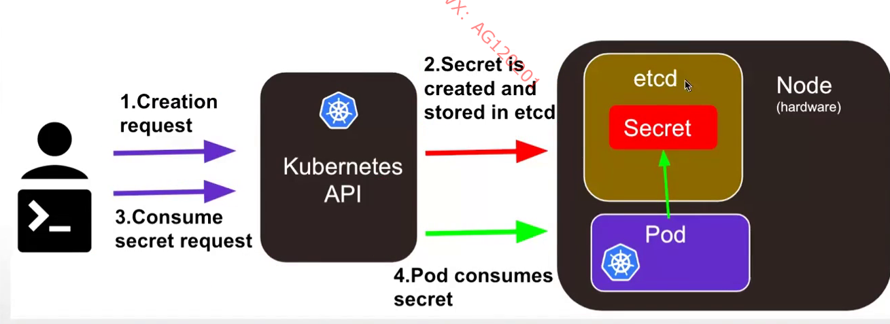


##### Secret类型

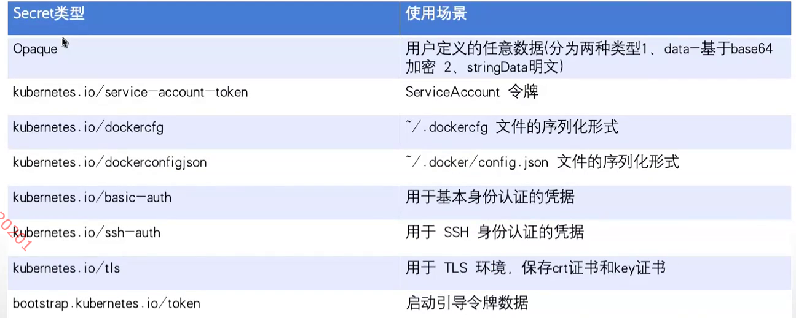


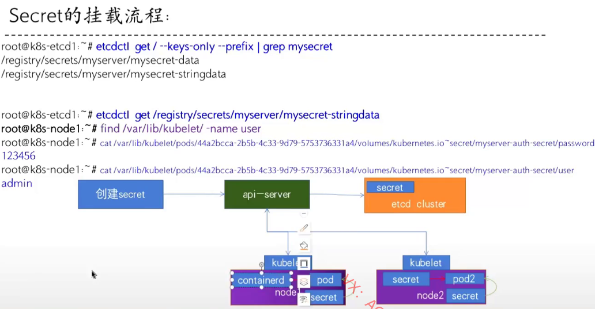

```yaml
#1-secret-Opaque-data 记得手动加密
#Key 就是文件名 值文件内容
apiVersion: v1
kind: Secret
metadata:
  name: mysecret-data
  namespace: myserver
type: Opaque
data:
  user: YWRtaW4K
  password: MTIzNDU2Cg==
  #age: 18 #非base64加密的会报错
  
---
#2-secret-Opaque-stringData
apiVersion: v1
kind: Secret
metadata:
  name: mysecret-stringdata
  namespace: myserver
type: Opaque
stringData:
  user: 'admin'
  password: '123456'

---
#3-secret-Opaque-mount
#apiVersion: extensions/v1beta1
apiVersion: apps/v1
kind: Deployment
metadata:
  name: myserver-myapp-app1-deployment
  namespace: myserver
spec:
  replicas: 1
  selector:
    matchLabels:
      app: myserver-myapp-app1
  template:
    metadata:
      labels:
        app: myserver-myapp-app1
    spec:
      containers:
      - name: myserver-myapp-app1
        image: tomcat:7.0.94-alpine
        ports:
        - containerPort: 8080
        volumeMounts:
        - mountPath: /data/myserver/auth
          name: myserver-auth-secret 
      volumes:
      - name: myserver-auth-secret
        secret:
          secretName: mysecret-data #挂载指定的secret,挂载后会将base64解密为明文

---
#4-secret-tls
apiVersion: v1
kind: Service
metadata:
  name: myserver-myapp-app1
  namespace: myserver
spec:
  ports:
  - name: http
    port: 8080
    targetPort: 8080
    nodePort: 30018
    protocol: TCP
  type: NodePort
  selector:
    app: myserver-myapp-app1

apiVersion: v1
kind: ConfigMap
metadata:
  name: nginx-config
  namespace: myserver
data:
 default: |
    server {
       listen       80;
       server_name  www.mysite.com;
       listen 443 ssl;
       ssl_certificate /etc/nginx/conf.d/certs/tls.crt;
       ssl_certificate_key /etc/nginx/conf.d/certs/tls.key;

       location / {
           root /usr/share/nginx/html; 
           index index.html;
           if ($scheme = http ){  #未加条件判断，会导致死循环
              rewrite / https://www.mysite.com permanent;
           }  

           if (!-e $request_filename) {
               rewrite ^/(.*) /index.html last;
           }
       }
    }

---
#apiVersion: extensions/v1beta1
apiVersion: apps/v1
kind: Deployment
metadata:
  name: myserver-myapp-frontend-deployment
  namespace: myserver
spec:
  replicas: 1
  selector:
    matchLabels:
      app: myserver-myapp-frontend
  template:
    metadata:
      labels:
        app: myserver-myapp-frontend
    spec:
      containers:
      - name: myserver-myapp-frontend
        image: nginx:1.20.2-alpine 
        ports:
          - containerPort: 80
        volumeMounts:
          - name: nginx-config
            mountPath:  /etc/nginx/conf.d/myserver
          - name: myserver-tls-key
            mountPath:  /etc/nginx/conf.d/certs
      volumes:
      - name: nginx-config
        configMap:
          name: nginx-config
          items:
             - key: default
               path: mysite.conf
      - name: myserver-tls-key
        secret:
          secretName: myserver-tls-key 


---
apiVersion: v1
kind: Service
metadata:
  name: myserver-myapp-frontend
  namespace: myserver
spec:
  type: NodePort
  ports:
  - name: http
    port: 80
    targetPort: 80
    nodePort: 30018
    protocol: TCP
  - name: htts
    port: 443
    targetPort: 443
    nodePort: 30019
    protocol: TCP
  selector:
    app: myserver-myapp-frontend 
    
    
    
---
#5-secret-imagePull
#apiVersion: extensions/v1beta1
apiVersion: apps/v1
kind: Deployment
metadata:
  name: myserver-myapp-frontend-deployment
  namespace: myserver
spec:
  replicas: 1
  selector:
    matchLabels:
      app: myserver-myapp-frontend
  template:
    metadata:
      labels:
        app: myserver-myapp-frontend
    spec:
      containers:
      - name: myserver-myapp-frontend
        image: registry.cn-qingdao.aliyuncs.com/zhangshijie/nginx:1.16.1-alpine-perl 
        ports:
          - containerPort: 80
      imagePullSecrets:
        - name: aliyun-registry-image-pull-key

---
apiVersion: v1
kind: Service
metadata:
  name: myserver-myapp-frontend
  namespace: myserver
spec:
  ports:
  - name: http
    port: 80
    targetPort: 80
    nodePort: 30018
    protocol: TCP
  type: NodePort
  selector:
    app: myserver-myapp-frontend 


```


### **nfs** 

node 节点要安装  nfs-common，还有用户映射的问题也要解决

需要保证Node节点可以挂载到 nfs服务器上，

nfs 卷允许将现有的 NFS(网络文件系统)挂载到容器中，且不像 emptyDir会丢失数据，当删除 Pod 时，nfs 卷的内容被保留，卷仅仅是被卸载，这意味着 NFS 卷可以预先上传好数据待pod启动后即可直接使用，并且网络存储可以在多 pod 之间共享同一份数据，即NFS 可以被多个pod同时挂载和读写。

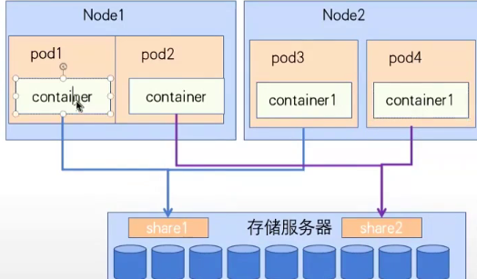


```yaml
apiVersion: apps/v1
kind: Deployment
metadata:
  name: nginx-deployment
spec:
  replicas: 1
  selector:
    matchLabels:
      app: ng-deploy-80
  template:
    metadata:
      labels:
        app: ng-deploy-80
    spec:
      containers:
      - name: ng-deploy-80
        image: nginx 
        ports:
        - containerPort: 80
        volumeMounts:
        - mountPath: /usr/share/nginx/html/mysite
          name: my-nfs-volume
      volumes:
      - name: my-nfs-volume
        nfs:
          server: 172.31.7.109
          path: /data/k8sdata

---
apiVersion: v1
kind: Service
metadata:
  name: ng-deploy-80
spec:
  ports:
  - name: http
    port: 81
    targetPort: 80
    nodePort: 30016
    protocol: TCP
  type: NodePort
  selector:
    app: ng-deploy-80
```

示例2

```yaml
apiVersion: apps/v1
kind: Deployment
metadata:
  name: nginx-deployment-site2
spec:
  replicas: 1
  selector:
    matchLabels:
      app: ng-deploy-81
  template:
    metadata:
      labels:
        app: ng-deploy-81
    spec:
      containers:
      - name: ng-deploy-81
        image: nginx 
        ports:
        - containerPort: 80
        volumeMounts:
        - mountPath: /usr/share/nginx/html/pool1
          name: my-nfs-volume-pool1
        - mountPath: /usr/share/nginx/html/pool2
          name: my-nfs-volume-pool2
      volumes:
      - name: my-nfs-volume-pool1
        nfs:
          server: 172.31.7.109
          path: /data/k8sdata/pool1
      - name: my-nfs-volume-pool2
        nfs:
          server: 172.31.7.109
          path: /data/k8sdata/pool2

---
apiVersion: v1
kind: Service
metadata:
  name: ng-deploy-81
spec:
  ports:
  - name: http
    port: 80
    targetPort: 80
    nodePort: 30017
    protocol: TCP
  type: NodePort
  selector:
    app: ng-deploy-81

```


## PV/PVC

删除Pod并不会删除PV

PV是集群资源

PVC是namespace资源


全局文件系统支持才可以 多Pod挂载

凡是一个卷被多个Pod挂载就是文件系统、有状态服务用块


pod调度到某个节点  随后kubelet调用内核先把nfs挂载到宿主机，在通过联合文件系统挂载到容器内部

创建 pv   pvc  pod    删除  pod  pvc  pv 


为了防止容器内时间不准，我们可以把宿主机的时区文件

/etc/localtime 挂载到容器内

```yml
apiVersion: v1
kind: PersistentVolume
metadata:
  name: myserver-myapp-static-pv
  namespace: myserver
spec:
  capacity:
    storage: 10Gi
  accessModes:
    - ReadWriteOnce
  nfs:
    path: /data/k8sdata/myserver/myappdata
    server: 172.31.7.109


---
apiVersion: v1
kind: PersistentVolumeClaim
metadata:
  name: myserver-myapp-static-pvc
  namespace: myserver
spec:
  volumeName: myserver-myapp-static-pv
  accessModes:
    - ReadWriteOnce
  resources:
    requests:
      storage: 10Gi

---
kind: Deployment
#apiVersion: extensions/v1beta1
apiVersion: apps/v1
metadata:
  labels:
    app: myserver-myapp 
  name: myserver-myapp-deployment-name
  namespace: myserver
spec:
  replicas: 1 
  selector:
    matchLabels:
      app: myserver-myapp-frontend
  template:
    metadata:
      labels:
        app: myserver-myapp-frontend
    spec:
      containers:
        - name: myserver-myapp-container
          image: nginx:1.20.0 
          #imagePullPolicy: Always
          volumeMounts:
          - mountPath: "/usr/share/nginx/html/statics"
            name: statics-datadir
      volumes:
        - name: statics-datadir
          persistentVolumeClaim:
            claimName: myserver-myapp-static-pvc 

---
kind: Service
apiVersion: v1
metadata:
  labels:
    app: myserver-myapp-service
  name: myserver-myapp-service-name
  namespace: myserver
spec:
  type: NodePort
  ports:
  - name: http
    port: 80
    targetPort: 80
    nodePort: 30080
  selector:
    app: myserver-myapp-frontend

```


## 资源需求（requests）和限制（limits）

### 资源需求和资源限制

#### 资源需求（requests）

```
定义需要系统预留给该容器使用的资源最小可用值
容器运行时可能用不到这些额度的资源，但用到时必须确保有相应数量的资源可用
资源需求的定义会影响调度器的决策
```

#### 资源限制（limits）

```
定义该容器可以申请使用的资源最大可用值，超出该额度的资源使用请求将被拒绝
该限制需要大于等于requests的值，但系统在其某项资源紧张时，会从容器那里回收其使用的超出其requests值的那部分
```

requests和limits定义在容器级别，主要围绕cpu、memory、hugepages和ephemeral-storage四种资源

spec.containers[].resources.limits.

◆cpu、memory、hugepages-<size>(大内存页) 和 ephemeral-storage(临时存储)

◼ spec.containers[].resources.requests.

◆cpu、memory、hugepages-<size> 和 ephemeral-storage


Extended resources

◼ 所有那些不属于kubernetes.io域的资源，即为扩展资源，例如“nvidia.com/gpu ”

◼ 又存在节点级别和集群级别两个不同级别的扩展资源


**注意：**

其实就是 如果定义我们requests2G  limis5G，但 requests 是软限制可以超过定义值，

在设置 `requests` 和 `limits` 时，我们可以选择在它们之间保留一些空间，以便 Pod 可以在需要时使用更多的资源。这个额外的空间就是软限制。如下例子中，设置了 `requests 2G` 和 `limits 5G`，中间的 3G 空间就是软限制。**但系统在其某项资源紧张时，会从容器那里回收其使用的超出其requests值的那部分**

但是当设置 `requests` 和 `limits` 相同时，即使 Pod 实际使用的资源超过了 `requests` 指定的值，由于 `limits` 的硬限制，Pod 也不能使用超过 `limits` 指定的资源量，因此就没有软限制了

```
实例：
requests 的优先级低，如果定义 requests 2G   limts 5G，但这个Pod1 运行到了  3G，
这时候启动新的Pod2，如果节点资源不够， Pod1 的资源会被回收到 2G , 给Pod2使用实例：
requests 的优先级低，如果定义 requests 2G   limts 5G，但这个Pod1 运行到了  3G，
这时候启动新的Pod2，如果节点资源不够， Pod1 的资源会被回收到 2G , 给Pod2使用
```


1. **内存不连续**：如果您设置了不同的资源请求和限制值，比如请求为 2G，限制为 5G，当 Pod 使用了超出请求但未达到限制的内存时（比如 3G），当 Pod 尝试申请额外的内存时，Kubernetes 可能会尝试从节点上的其他 Pod 中回收一部分内存来满足其需求。这种情况下，节点上的内存可能会被切割成不连续的部分，导致内存碎片化问题。
2. **降低服务质量 (QoS)**：如果资源请求和限制的差距较大，而其他 Pod 的资源请求又接近节点的总可用资源，那么当新的 Pod 启动时，Kubernetes 可能会选择回收资源较少的 Pod 来满足新 Pod 的请求。这样做可能会降低资源请求较小的 Pod 的服务质量，因为它们可能会被频繁地回收和重新调度。


**服务质量**：

```yaml
#如果都定义相同最高，如果没定义最低，其他的都是中等，如果资源不够用就会上kill最低的依次kill
Pod的QoS类别：
     BestEffort: 最低
          未定义requests和limits
   
     Burstable   中间

    
     Garanteed： 最高
            cpu.requests    ==  cpu.limits
            memory.ruquests ==  memroy.limits 

        CPU资源单位：
            1 core == 1000m
                100m <= 总体上单个核心的10% 

        内存资源单位：
            Ki, Mi, Gi, ...

1 core == 1000m 如果我们定义某个容器的CPU资源限制是 100m，我们top观察单个核心的10%，如果我们有四个核心那么每个核心上占用2.5%
```


## HPA 控制器

弹性伸缩

当访问量达到一定指标时(高峰期)，自动扩容

低峰期，自动缩容

提高性能，降低Pod负载

公有云支持node级别的tan 


**Pod 水平弹性伸缩 HPA**

- 基于Pod资源利用率横向调整Pod副本数


**Pod垂直弹性伸缩 VPA**

- 基于Pod资源利用率，调整对单个Pod的最大资源限制，不能于HPA一起使用


**集群伸缩 CA (Cluster Autoscaler CA)**

- 基于集群中Node 资源使用情况，动态伸缩Node节点，从而保证有Cpu，内存等资源创建Pod


​	当集群资源不足时，Pod没办法调度到有 资源的节点 此时Pod就会被pending，此时我们就需要横向扩展Node节点  公有云支持


默认，新的值和默认值差别在0.1以上才会扩容，降了0.1才会缩


计算Pod利用率得出值

比如：

我有三个Pod,我设置了阈值50%，超出50%就要扩容，但他们的当前利用率都是不均匀的，相加算出平均值决定扩

85+75+80=240/3  =80 算出没个Pod平均占用率80

假设我们有三个Pod，我们定义如果超过50%就要扩容，但我们是一组Pod要把他们加起来算出


1=  当前阈值--设定的阈值= 超出默认容忍值的数值


当前副本数 X 当前指标 / 定义指标

假如我们3个Pod  他们的CPU负载分别是 80%  70%  60% ，我定义如果超过50%就要扩容 


- TotalCurrentPodsTotalCurrentPods 是当前的Pod副本总数。
- AverageCurrentMetricValueAverageCurrentMetricValue 是当前Pod副本的平均CPU负载。
- DesiredMetricThresholdDesiredMetricThreshold 是期望的CPU负载阈值，即当负载超过这个阈值时就触发扩容。

对于你提供的例子，假设有3个Pod，分别有80%，70%，60%的CPU负载，且期望的CPU负载阈值为50%。我们可以计算期望的Pod副本数量：


首先，计算平均CPU负载：80%+70%+60%3=70%380%+70%+60%=70%。

然后，代入公式：

DesiredReplicas=⌈3×70%50%⌉DesiredReplicas=⌈3×70%/50%⌉

DesiredReplicas=⌈2.10.5⌉DesiredReplicas=⌈2.1/0.5⌉

DesiredReplicas=⌈4.2⌉DesiredReplicas=⌈4.2⌉

DesiredReplicas=5DesiredReplicas=5


Hpa 控制器怎么计算Pod CPu和内存的占比

​	要求在创建Pod时必须定义limits 定义资源限制

用当前使用的百分比 /  我们定义的值 = 当前资源的百分比

比如我们定义cpu 1000  现在用到了 600  600/1000=60%

### Metrice-server 部署

Metrice-server会启一个Pod 从各个Ndoe节点上个的Kublet收集指标数据


## 网络

#### Vlan

虚拟局域网VLAN可以隔离广播域，如果所有机器都在同一个局域网内发起一次广播，对其他机器来说会造成很多垃圾流量，

在典型交换网络中，当某台主机发送一个广播帧或未知单播帧时，该数据帧会被泛洪，甚至传递到整个广播域。

广播域越大，产生的网络安全问题、垃圾流量问题就越严重。


### Vxlan

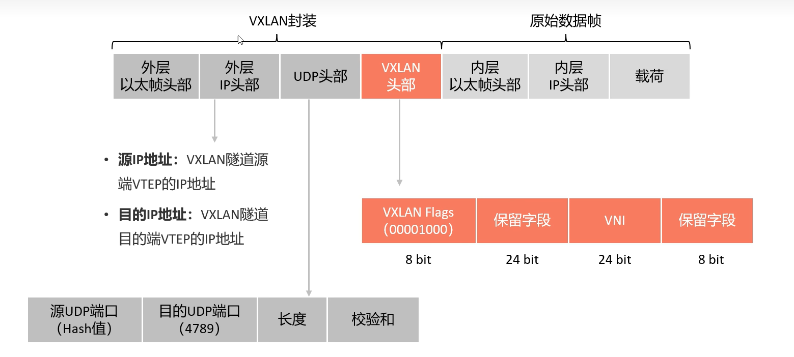


### NVE 网络虚拟边缘

将普通网络接入到Vxlan网络中，普通网络和Vxlan网络的联节点

是实现网络虚拟化功能的网络实体，可以是硬件交换机也可以是软件交换机。
NVE在三层网络上构建二层虚拟网络，是运行VXLAN的设备。图中sW1和SW2都是NVE。

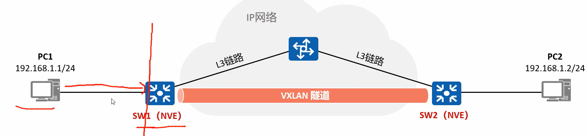


#### 

### VTEP(VXLAN TunnelEndpoints，VXLAN隧道端点)

Vtyep就是nve的IP

VTEP是VXLAN隧道端点，位于NVE中，用于VXLAN报文的封装和解封装。
VXLAN报文(其外层IP头部)中源IP地址为源端VTEP的IP地址，目的IP地址为目的端VTEP的IP地址。

VXLAN隧道由一对VTEP确定，报文在VTEP设备进行封装之后在VXLAN隧道中依靠路由进行传输。
只要VXLAN隧道的两端VTEP是三层路由可达的，VXLAN隧道就可以建立成功。

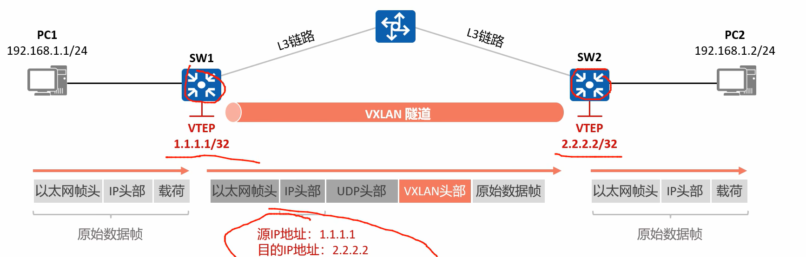


#### VNI 

用于标识虚拟网络中的隧道和VlanID 类似


### Overlay  

**Overlay 网络通信**

要对报文进行封装和解封装，可以和node节点使用不同的网络地址，性能不如underlay


首先需要将 Pod 的 IP 地址和 MAC 地址封装到数据包中。这是为了在 Overlay 网络中标识源地址和目标地址。然后添加源宿主机的VTYPE封装Vxlan，网络层设备将封装后的报文通过标准的报文在三层网络进行转发到目标主机，当数据包到达目标宿主机时，目标宿主机的 VTEP 将会解封装 VXLAN、UDP 和 IP 头部，还原出原始的数据包内容。

**Pod 发送请求**---**封装 Pod IP 和 MAC**---**添加源宿主机的 VTEP 封装 VXLAN**----**网络层设备进行转发**---**目标宿主机 VTEP 解封装**

CNI-0会像交换机一样记录通讯过的Pod mac 地址

每一个Pod都有一对网卡，一半在宿主机上， CNI-0(虚拟交换机) 是这台node节点上Pod的网关，Pod网卡逻辑上和CNI-0交换机连通的，Pod1请求Pod2时CNI-0会记录下mac地址直接转发给Pod2，如果要请求Pod3就得走Flannel 封装VTYPE-Vxlan，然后从宿主机出去到交换机路由器到达对方


使用 VXLAN（Virtual Extensible LAN）网络模型时，Flannel 通常会使用 VTEP（VXLAN Tunnel Endpoints）来进行通信。每个节点上的 Flannel 代理都会有一个 VTEP 接口（通常是一个虚拟接口），用于 VXLAN 封装和解封装数据包。为了确定对方 Flannel.1 的 MAC 地址，你需要使用 VXLAN 和 Flannel 的相关配置来获取。

通常情况下，Flannel 会通过 etcd（或其他 key-value 存储）来存储节点之间的网络拓扑信息，包括节点的 IP 地址和 VTEP 接口的 MAC 地址。当一个节点需要发送数据到另一个节点时，它会查询 etcd 来获取目标节点的 VTEP 接口的 MAC 地址。

具体步骤如下：

1. **查询 etcd**：节点会查询 etcd 来获取目标节点的 VTEP 接口的 IP 地址和 MAC 地址。
2. **构建 VXLAN 报文**：一旦获取了目标节点的 VTEP IP 地址和 MAC 地址，节点会使用这些信息来构建 VXLAN 报文。
3. **发送 VXLAN 报文**：节点会将 VXLAN 报文发送到目标节点的 VTEP IP 地址，以便目标节点能够解封 VXLAN 报文并将其传递给目标容器。

在这个过程中，Flannel 需要确保 etcd 中存储的网络拓扑信息是准确的，并且节点能够通过网络访问到 etcd。同时，Flannel 需要能够正确地解析 VXLAN 报文，并将其传递给目标容器。

需要注意的是，具体的实现方式可能会因为 Flannel 和 VXLAN 的版本而有所不同，因此在实际应用中需要根据具体的情况来进行配置和调整。

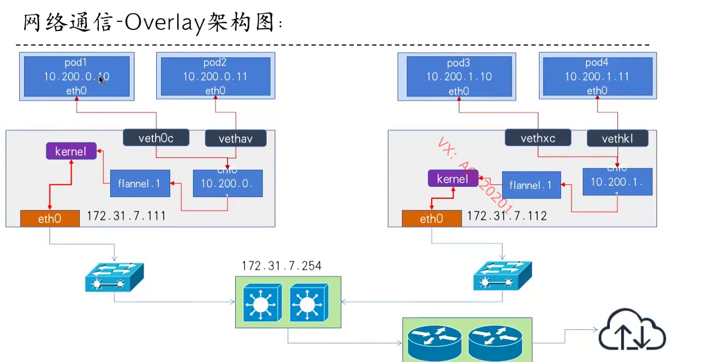


### underlay 

Pod与宿主机使用相同子网的网络，不需要拆包解包，会消耗很多IP因为每个Pod要用IP 而且不能跨子网通讯，性能好

容器网络中的Underlay网络是指借助驱动程序将宿主机的底层网络接口直接暴露给容器使用的一种网络构建技术较为常见的解决方案有MAC VLaN、IP VLAN和直接路由等。

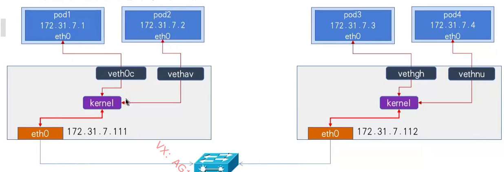

#### Mac Vlan模式:

支持在同一个以太网接口上虚拟出多个网络接口(子接口)，每个虚拟接口都拥有唯一的MAC地址并可配置网卡子接口IP

IP VLAN模式:
类似于MACVLAN，它同样创建新的虚拟网络接口并为每个接口分配唯一的!P地址，不同之处在于，每个虚拟接口将共享使用物理接口的MAC地址

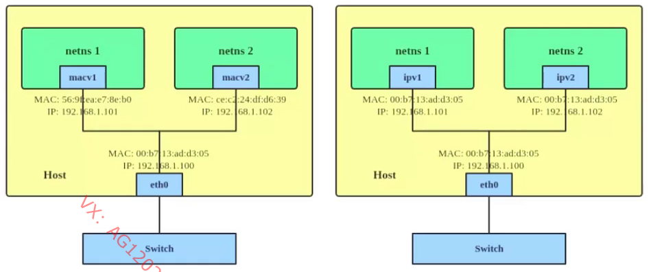


#### Mac Vlan工作模式

bridge模式:
在bridge这种模式下，使用同一个宿主机网络的maevlan容器可以直接实现通信，推荐使用此模式


#### 总结

Overlay:基于VXLAN、NVGRE等封装技术实现overlay叠加网络
Underlay MaC VLAN:基于宿主机物理网卡的不同子接口实现多个虚拟vlan，一个子接口就是一个虚拟vlan，容器通过宿主机的路由功能和外网保持通信。


Overlay 

当数据包从 Pod 出来后，它将被传递给 CNI 插件，CNI 插件会检查数据包的目标地址，如果目标地址指示数据包需要发送到另一台主机上的容器，CNI 插件将请求发送给网络插件，网络插件会执行必要的封装操作，以便将数据包发送到目标主机。这包括添加 VXLAN Vtype或其他封装头部，以便在 Overlay 网络中进行传输。

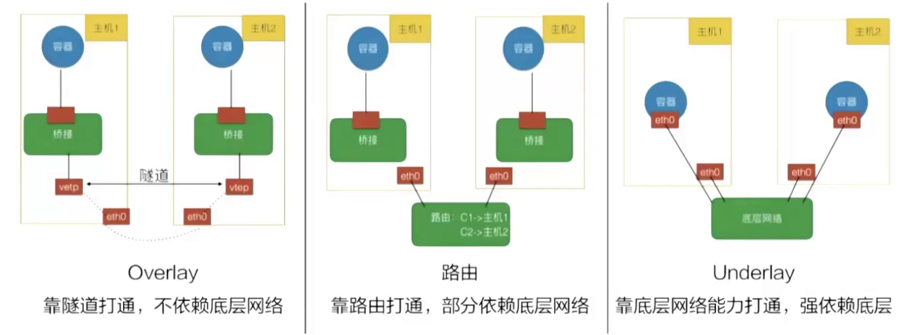


直接路由:
Flannel Host-gw、Flannel VXLAN Directrouting、 Calico Directrouting

基于主机路由，实现报文从源主机到目的主机的直接转发，不需要进行报文的叠加封装，性能比overlay更好

1. **数据包从源容器出来**：首先，源容器内的应用程序生成一个网络请求，产生了一个数据包。
2. **到达 Docker0 网桥**：数据包离开源容器后，它将到达 Docker0 网桥。
3. **宿主机的网卡接收数据包**：由于您已将宿主机的网卡桥接到 Docker0 网桥上，因此数据包将通过宿主机的网卡接收。
4. **宿主机的网卡处理数据包**：宿主机的网卡接收到数据包后，它将根据网络配置进行处理。由于宿主机的网卡已经桥接到 Docker0 网桥上，因此它将继续将数据包传递到 Docker0 网桥。
5. **Docker0 网桥转发数据包**：数据包再次到达 Docker0 网桥，然后根据目标地址的 IP 地址和 Docker 网络配置，Docker0 网桥将决定将数据包转发到其他主机上。
6. **目标主机的网卡接收数据包**：数据包到达目标主机后，它将被目标主机的网卡接收。
7. **目标主机上的 Docker0 网桥接收数据包**：如果目标主机上也存在 Docker0 网桥（假设是），那么数据包将进入 Docker0 网桥。
8. **目标主机上的容器接收数据包**：最后，数据包将被传递到目标主机上的目标容器。


Underlay：

需要为pod启用单独的虚拟机网络，而是直接使用宿主机物理网络，pod甚至可以在k8s环境之外的节点直接访问(与node节点的网络被打通)，相当于把pod当桥接模式的虚拟机使用，比较方便k8s环境以外的访问访问k8s环境中的pod中的服务，而且由于主机使用的宿主机网络，其性能最好。


Calilco

默认会在每个Node节点创建一个给Pod使用的在子网，但一般较小，/26位的，如果用完了还会接着创建


IPIP模式：

tunl0


#### NetworkPolicy

支持命名空间，端口，协议

如果其他命名空间没做策略，我所在的namese做了网络策略，但我可以随便访问没有做策略的

默认情况下，不仅当前命名空间可以通，跨命名空间也可以通

Ingress 类型，对Pod入口流量做限制，比如我只允许Pod1，Pod2访问我

Engress 类型，对Pod出口流量做限制，比如


先选择要对哪个Pod做网络策略（目的Pod），然后在选择要对入栈的Pod 做什么限制

如果不指定入栈Pod，那么就是该命名空间下所有的Pod

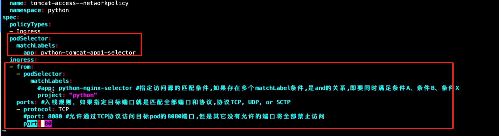


如果不指定入栈Pod，那么就是该命名空间下所有的Pod

意思该命名空间下的所有Pod可以访问我的，80，8080，6379

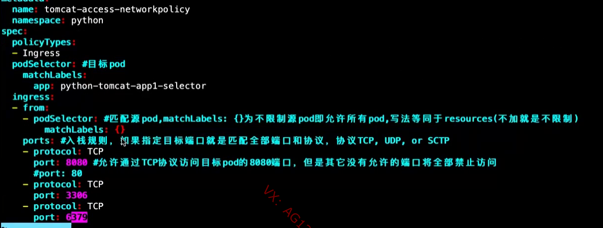


白名单

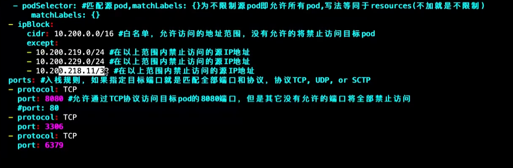


##### ingress-namespace Selector-ns选择器

1.被明确允许的namespace中的pod可以访问目标pod
2.没有明确声明允许的namespace将禁止访问
3.没有明确声明允许的话，即使同一个namespace也禁止访问 (记得允许自己访问自己，如果自己在 FEI namespace 那也要允许自己所在的命名空间不然自己无法访问自己)

4.比如只允许了linux和python两个ns，那么default中的pod将无法访问


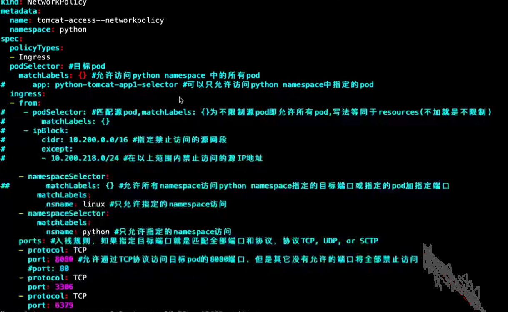


#### Engress

如果基于端口做限制，一定要打开 53端口 DNS 不然无法域名解析

1.基于Egress白名单,定义ns中匹配成功的pod可以访问ipBlock指定的地址和ports指定的端口。
2.匹配成功的pod访问未明确定义在Eqress的白名单的其它IP的请求，将拒绝。
3.没有匹配成功的源pod,主动发起的出口访问请求不受影响。

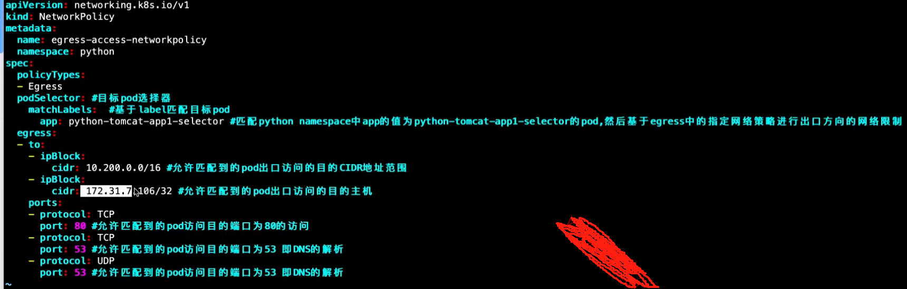


1.匹配成功的源pod只能访问指定的目的pod的指定端口

2.其它没有允许的出口请求将禁止访问

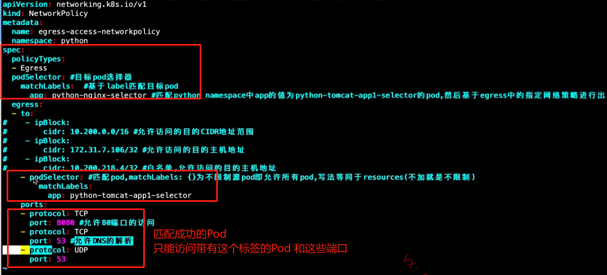


基于命名空间

匹配成果的Pod只能访问指定的命名空间


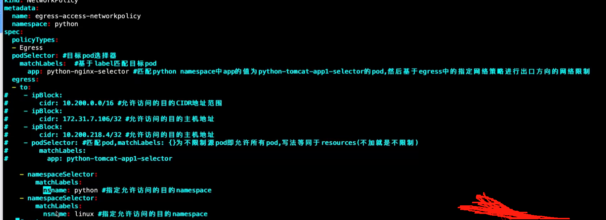


### ingress-nginx 

基于nginx 二次开发，可以动态更新配置文件

Ingress 是 kubernetes AP|中的标准资源类型之一，ingress 实现的功能是在应用层对客户端请求的 host 名称或请求的 URL路径把请求转发到指定的 service 资源的规则，即用于将 kuberetes 集群外部的请求资源转发之集群内部的 service，再被 service 转发之 pod处理客户端的请求

hostnetwork: true

ingress要和Pod在同一个命名空间

server endpoints

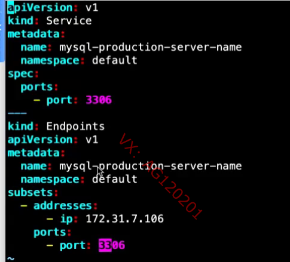


ingress 更新证书的要点

